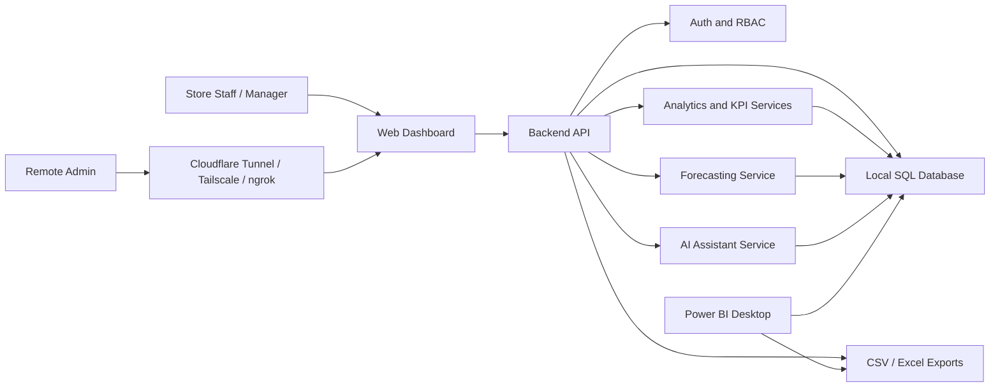
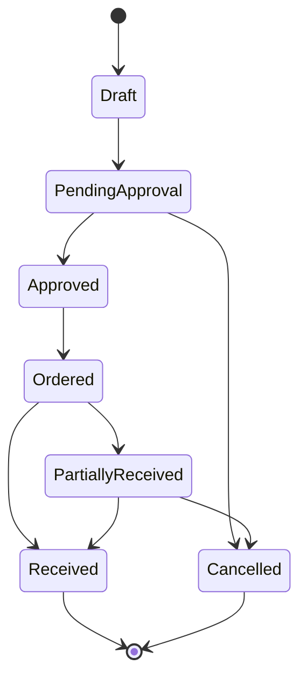
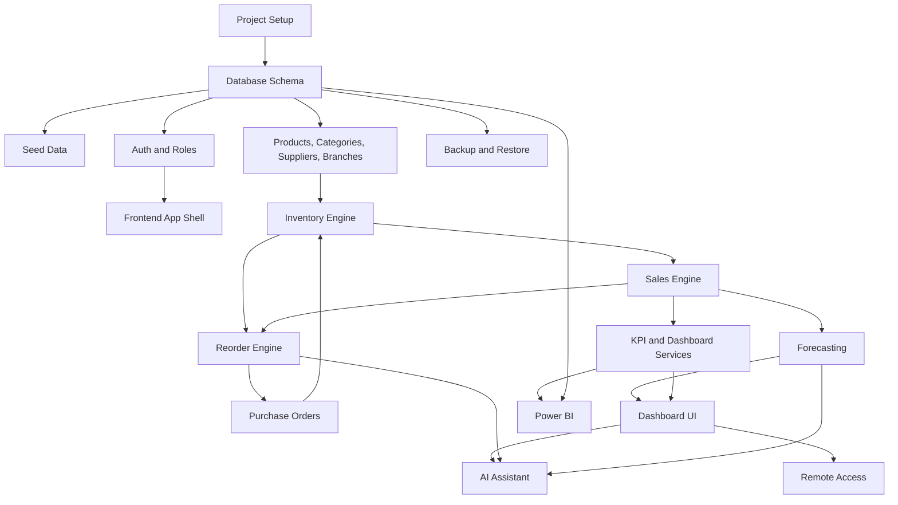

# Execution Flow Analysis

## Project

AI-Powered Hybrid Retail Inventory, Sales Analytics, and Remote Order Management System

## Purpose Of This Document

This document breaks the PRD into a clear execution plan. It explains how the full system should flow, how modules depend on each other, what should be built first, and what each development part must deliver before moving to the next part.

Use this file as the build guide for an AI coding agent, developer, or student implementation.

The PRD explains what the product is. This document explains how to execute it in the right order.

## 1. Project Understanding

The system is a hybrid local-first retail business platform.

The main business data stays in a local SQL database to reduce cloud cost. The admin accesses a secure web dashboard remotely through a tunnel or private network. The system helps the admin monitor stock, review sales, place purchase orders, see forecasts, use Power BI reports, and ask an AI assistant business questions.

The project must prove five major skills:

- SQL and business intelligence
- Full-stack product development
- AI assistant integration
- Data analytics and forecasting
- Cost-aware cloud/hybrid architecture

## 2. Core Product Flow

At a high level, the system works like this:

1. Store staff or manager records sales and stock updates.
2. Data is stored in the local SQL database.
3. Backend services calculate stock levels, sales summaries, alerts, and KPIs.
4. Admin opens the web dashboard remotely.
5. Admin reviews sales, stock, low-stock items, suppliers, and purchase orders.
6. Reorder engine suggests products to purchase.
7. Admin creates or approves purchase orders remotely.
8. Forecasting service predicts sales and demand.
9. AI assistant answers business questions using database-backed tools.
10. Power BI connects to local data or exported reporting views for executive dashboards.

## 3. System Context Flow

Important rule:

The remote browser must never connect directly to the database. All access must go through the backend API.

## 4. Main Business Flows

### Flow 1: Login And Access Control

1. User opens dashboard.
2. User enters credentials.
3. Backend verifies password hash.
4. Backend creates session or token.
5. Backend returns user role and allowed branch scope.
6. Frontend shows pages allowed for that role.
7. Backend still enforces permissions on every API request.

Key result:

The UI may hide unauthorized features, but security must be enforced by the backend.

### Flow 2: Sales Entry Updates Inventory

1. Staff creates sale.
2. Backend validates branch, product, quantity, and price.
3. Backend creates sales record.
4. Backend creates sale item records.
5. Backend reduces product inventory for the branch.
6. Backend creates stock movement records with movement type `sale`.
7. Dashboard KPIs update from sales and inventory data.

Key result:

Sales are not just financial records. They must also change stock.

### Flow 3: Low-Stock Detection

1. Backend reads product inventory.
2. Backend compares quantity on hand with reorder threshold.
3. Backend calculates average daily sales.
4. Backend estimates days until stockout.
5. Backend assigns priority: critical, high, medium, or low.
6. Low-stock dashboard shows recommended action.

Key result:

Low-stock logic must combine current quantity and recent sales speed, not only a static threshold.

### Flow 4: Reorder Recommendation To Purchase Order

1. Admin opens Low-Stock and Reorder page.
2. System displays suggested reorder quantity.
3. Admin selects products to order.
4. System groups selected products by supplier and branch.
5. System creates purchase order draft.
6. Admin reviews quantities and costs.
7. Admin submits or approves the order.
8. Backend audit logs the action.

Key result:

Reorder recommendations should directly support purchase order creation.

### Flow 5: Purchase Order Receiving Updates Inventory

1. Admin or manager opens an approved or ordered purchase order.
2. User enters received quantity per line item.
3. Backend validates quantity received.
4. Backend increases inventory quantity on hand.
5. Backend reduces quantity on order.
6. Backend creates stock movement records with movement type `purchase_received`.
7. Purchase order status changes to `Partially Received` or `Received`.

Key result:

Purchase orders only affect available stock when goods are received, not merely when the order is created.

### Flow 6: Forecasting Flow

1. Forecasting service reads historical sales.
2. Service groups data by product, category, branch, or total revenue.
3. Service checks whether enough history exists.
4. Service runs forecasting model.
5. Service saves forecast outputs.
6. Forecast dashboard shows future sales or demand.
7. AI assistant can summarize forecast results.

Key result:

Forecasting must handle insufficient data gracefully.

### Flow 7: AI Assistant Flow

1. Admin asks a business question.
2. Backend receives question.
3. AI assistant classifies intent.
4. Assistant calls approved data retrieval tools or backend services.
5. Assistant receives actual database results.
6. Assistant produces a business-friendly answer.
7. If a write action is requested, assistant asks for confirmation.
8. Only after confirmation and permission check can backend create or update records.

Key result:

The AI assistant must not invent numbers and must not change business records without confirmation.

### Flow 8: Power BI Reporting Flow

1. Backend or database exposes reporting tables/views.
2. Power BI connects to the local database or imports exported CSV files.
3. Power BI report displays executive KPIs.
4. Admin refreshes report from local data.

Key result:

Power BI is for reporting and presentation. Operational actions remain inside the web dashboard.

## 5. Execution Strategy

Build the project in vertical slices, not as disconnected pages.

A vertical slice means each part should include database, backend, and frontend where possible. For example, do not build only the Inventory UI first. Build enough database, API, and UI together so inventory actually works end to end.

The recommended build style:

1. Foundation first
2. Master data second
3. Transaction flows third
4. Dashboards fourth
5. Analytics and AI after reliable data exists
6. Remote access and portfolio polish last

## 6. Project Breakdown By Execution Parts

## Part 0: Project Decisions And Setup

### Goal

Lock the technical foundation before writing feature code.

### Recommended Decisions

- Frontend: React with TypeScript
- Backend: FastAPI with Python
- Database: PostgreSQL local
- ORM: SQLAlchemy
- Migrations: Alembic
- Charts: Recharts or ECharts
- Styling: Tailwind CSS or a clean component system
- AI: OpenAI API first, local LLM optional later
- Remote access: Cloudflare Tunnel or Tailscale

### Tasks

- Create repo structure.
- Add backend app.
- Add frontend app.
- Add database configuration.
- Add environment variable templates.
- Add README skeleton.
- Add coding conventions.

### Deliverables

- Working backend health endpoint.
- Working frontend shell.
- Local database connection tested.
- `.env.example` created.
- Basic setup instructions.

### Completion Checkpoint

The developer can run backend, frontend, and database locally.

## Part 1: Database Foundation And Seed Data

### Goal

Create the database structure and realistic sample data that powers the whole product.

### Tables To Build First

- users
- branches
- categories
- suppliers
- products
- inventory
- stock_movements
- sales
- sale_items
- purchase_orders
- purchase_order_items
- forecasts
- ai_chat_sessions
- ai_chat_messages
- audit_logs

### Tasks

- Define schema models.
- Create migrations.
- Add indexes for dashboard queries.
- Add seed data.
- Add basic reporting views if useful.

### Seed Data Requirements

- 2 to 3 branches
- 5 to 8 categories
- 50 to 100 products
- 8 to 15 suppliers
- 6 to 12 months of sales history
- Inventory for each product and branch
- 20 to 50 purchase orders
- Some low-stock products
- Some slow-moving products
- Some fast-moving products

### Deliverables

- Database schema.
- Migration files.
- Seed script.
- Sample admin, manager, staff, and analyst users.
- Realistic sample business data.

### Completion Checkpoint

Dashboards can be built from sample data without empty screens.

## Part 2: Backend Foundation, Auth, And Permissions

### Goal

Create the secure API foundation.

### Tasks

- Add FastAPI app structure.
- Add database session handling.
- Add password hashing.
- Add login endpoint.
- Add current user endpoint.
- Add role-based permission utilities.
- Add audit logging utility.
- Add error response format.

### Core Endpoints

- `POST /auth/login`
- `POST /auth/logout`
- `GET /auth/me`
- `GET /health`

### Permission Rules

- Admin can access all branches.
- Store Manager can access assigned branch.
- Staff can add sales and limited stock updates.
- Analyst can view reports but not modify operational data.

### Deliverables

- Auth works.
- Backend permission checks exist.
- Audit logs are created for important auth actions.

### Completion Checkpoint

Unauthorized users cannot access protected APIs, and role checks work from backend tests.

## Part 3: Frontend App Shell

### Goal

Create the user interface base that all pages will use.

### Tasks

- Build login page.
- Build authenticated layout.
- Build sidebar navigation.
- Build top bar with user info.
- Build role-aware route handling.
- Build reusable table, filter, chart, and metric card components.
- Add loading, empty, and error states.

### Navigation Pages

- Overview
- Sales Summary
- Inventory
- Low Stock and Reorder
- Purchase Orders
- Suppliers
- Forecasting
- AI Assistant
- Power BI Reports
- Settings

### Deliverables

- User can log in from UI.
- User sees correct navigation based on role.
- App shell works on desktop and tablet.

### Completion Checkpoint

The dashboard shell is usable even before all pages are fully connected.

## Part 4: Master Data Management

### Goal

Build product, category, supplier, and branch management.

### Tasks

- Product CRUD.
- Category CRUD.
- Supplier CRUD.
- Branch CRUD, admin only.
- Product-supplier relationship.
- Reorder threshold and target stock fields.
- Active/inactive states.

### Backend APIs

- `GET /products`
- `POST /products`
- `GET /products/{id}`
- `PUT /products/{id}`
- `PATCH /products/{id}/deactivate`
- `GET /categories`
- `POST /categories`
- `GET /suppliers`
- `POST /suppliers`
- `PUT /suppliers/{id}`
- `GET /branches`
- `POST /branches`

### Frontend Pages

- Product list
- Product form
- Supplier list
- Supplier form
- Settings or branch management

### Deliverables

- Admin can manage business master data.
- Products link to categories and suppliers.
- SKU uniqueness is enforced.

### Completion Checkpoint

Products, suppliers, and branches can be managed without direct database edits.

## Part 5: Inventory Engine

### Goal

Create reliable stock tracking.

### Key Rule

Inventory must change through controlled backend services and stock movement records.

### Tasks

- Create inventory list API.
- Create inventory detail API.
- Add manual stock adjustment.
- Add stock movement ledger.
- Add low-stock detection.
- Add inventory filters.

### Backend APIs

- `GET /inventory`
- `GET /inventory/{product_id}`
- `GET /inventory/low-stock`
- `POST /inventory/adjustments`
- `GET /inventory/movements`

### Frontend Pages

- Inventory table
- Product stock detail
- Stock adjustment modal
- Low-stock filter

### Deliverables

- Admin can view stock by product, branch, category, and supplier.
- Authorized users can adjust stock with reason.
- Every stock change creates a stock movement record.

### Completion Checkpoint

Inventory totals and stock movement history match after manual adjustments.

## Part 6: Sales Engine

### Goal

Create sales recording and make sales affect inventory.

### Tasks

- Add sales creation API.
- Add sale items.
- Calculate subtotal, discounts, tax, and total.
- Reduce inventory after sale.
- Create stock movement records.
- Add sales list and detail views.
- Add sales summary API.

### Backend APIs

- `GET /sales`
- `POST /sales`
- `GET /sales/{id}`
- `GET /sales/summary`
- `GET /sales/trends`

### Frontend Pages

- Add sale form
- Sales list
- Sales summary page

### Deliverables

- Staff can create sales.
- Inventory decreases after sales.
- Sales summary metrics are calculated.

### Completion Checkpoint

Creating a sale updates sales tables, inventory, stock movements, and dashboard metrics.

## Part 7: KPI And Dashboard Services

### Goal

Create business dashboards from real backend calculations.

### Tasks

- Build KPI service layer.
- Build SQL views or optimized queries.
- Add date range filters.
- Add branch/category/product filters.
- Add comparison to previous period.
- Add dashboard endpoints.

### Backend APIs

- `GET /dashboard/overview`
- `GET /dashboard/sales`
- `GET /dashboard/inventory`
- `GET /dashboard/purchase-orders`

### KPI Calculations

- Revenue
- Gross profit
- Gross margin percent
- Units sold
- Average order value
- Stock value
- Low-stock count
- Pending purchase orders
- Sales growth percent
- Slow-moving stock

### Frontend Pages

- Overview dashboard
- Sales dashboard
- Inventory dashboard

### Deliverables

- Dashboard shows real values from database.
- Filters update metrics.
- Charts and tables are connected to APIs.

### Completion Checkpoint

The project starts to feel like a real business dashboard.

## Part 8: Reorder Recommendation Engine

### Goal

Help admins decide what to order.

### Inputs

- Current stock
- Reorder threshold
- Target stock level
- Average daily sales
- Supplier lead time
- Quantity already on order

### Formula

Suggested reorder quantity = target stock level - current quantity on hand + expected demand during supplier lead time

Expected demand during lead time = average daily sales * supplier lead time

Final suggested quantity must not be negative.

### Tasks

- Calculate average daily sales by product and branch.
- Estimate runout date.
- Assign priority.
- Generate reorder recommendation list.
- Allow admin override.

### Backend APIs

- `GET /inventory/reorder-recommendations`
- `POST /purchase-orders/from-recommendations`

### Frontend Pages

- Low-stock and reorder page
- Recommendation table
- Create purchase order draft action

### Deliverables

- Admin can see which products to reorder.
- Admin can create a purchase order draft from selected recommendations.

### Completion Checkpoint

Low-stock products can flow into purchase order creation.

## Part 9: Purchase Order Workflow

### Goal

Build the order lifecycle from draft to received.

### Purchase Order Status Flow

### Tasks

- Create purchase order manually.
- Create purchase order from recommendations.
- Submit for approval.
- Approve order.
- Cancel order.
- Mark as ordered.
- Receive full or partial quantity.
- Update inventory on receiving.
- Update quantity on order.
- Audit all status changes.

### Backend APIs

- `GET /purchase-orders`
- `POST /purchase-orders`
- `GET /purchase-orders/{id}`
- `PUT /purchase-orders/{id}`
- `POST /purchase-orders/{id}/submit`
- `POST /purchase-orders/{id}/approve`
- `POST /purchase-orders/{id}/cancel`
- `POST /purchase-orders/{id}/mark-ordered`
- `POST /purchase-orders/{id}/receive`

### Frontend Pages

- Purchase order list
- Purchase order detail
- Purchase order form
- Receive order modal
- Approval actions

### Deliverables

- Admin can create and approve purchase orders remotely.
- Receiving orders updates inventory.
- Status flow is controlled.

### Completion Checkpoint

The complete reorder-to-receiving workflow works end to end.

## Part 10: Forecasting And Demand Prediction

### Goal

Use historical sales to predict future sales or demand.

### MVP Forecasting Approach

Start simple:

- Moving average
- Linear trend
- Seasonal average if enough data exists

Advanced optional:

- Prophet
- statsmodels
- scikit-learn regression

### Tasks

- Build forecasting service.
- Add data sufficiency checks.
- Forecast by total revenue first.
- Forecast by product/category/branch after MVP.
- Store forecast output.
- Add forecast dashboard.

### Backend APIs

- `POST /forecasts/run`
- `GET /forecasts`
- `GET /forecasts/products/{product_id}`

### Frontend Page

- Forecasting dashboard

### Deliverables

- Admin can run forecast.
- Forecast chart displays historical and predicted values.
- System explains whether trend is increasing, decreasing, or stable.

### Completion Checkpoint

Forecast results appear in the dashboard and can support reorder planning.

## Part 11: AI Assistant

### Goal

Add a business assistant that answers questions using real system data.

### MVP AI Scope

The first AI version should be mostly read-only.

It should answer:

- Current sales summary
- Low-stock items
- Top-selling products
- Slow-moving products
- Pending purchase orders
- Forecast summaries
- Reorder recommendations

### AI Tool Layer

Create safe backend functions the assistant can call:

- `get_sales_summary`
- `get_low_stock_items`
- `get_top_products`
- `get_slow_moving_products`
- `get_pending_purchase_orders`
- `get_reorder_recommendations`
- `get_forecast_summary`

### Confirmation-Gated Actions

Later, the assistant may support:

- Create purchase order draft
- Submit purchase order
- Adjust reorder threshold

These must require user confirmation and permission checks.

### Tasks

- Build chat UI.
- Build AI chat endpoint.
- Add intent/tool routing.
- Add database-backed tool functions.
- Store chat sessions and messages.
- Add guardrails for missing data.
- Add confirmation flow for write actions.

### Backend APIs

- `POST /ai/chat`
- `GET /ai/sessions`
- `GET /ai/sessions/{id}`

### Deliverables

- Admin can ask business questions.
- Assistant answers using real data.
- Assistant does not invent numbers.
- Assistant refuses unauthorized or unsafe actions.

### Completion Checkpoint

The assistant can answer at least 8 predefined business questions correctly from the database.

## Part 12: Power BI Integration

### Goal

Create executive reporting outside the operational app.

### Tasks

- Create reporting SQL views.
- Add export endpoints if needed.
- Prepare Power BI data model.
- Build Power BI pages.
- Document refresh process.

### Reporting Views

Recommended views:

- `vw_sales_summary`
- `vw_sales_by_product`
- `vw_sales_by_category`
- `vw_inventory_health`
- `vw_low_stock`
- `vw_purchase_order_status`
- `vw_supplier_performance`
- `vw_forecast_summary`

### Power BI Pages

- Executive Overview
- Sales Performance
- Inventory Health
- Supplier and Purchase Orders
- Forecast and Recommendations

### Deliverables

- Power BI file or screenshots.
- SQL views or CSV exports.
- Refresh instructions.

### Completion Checkpoint

Power BI can display executive reports using system data.

## Part 13: Remote Access And Hybrid Deployment

### Goal

Make the dashboard accessible remotely while keeping the database local.

### Recommended Remote Access Options

- Cloudflare Tunnel for public demo URL.
- Tailscale for private secure access.
- ngrok for temporary demo.

### Tasks

- Run backend locally.
- Run frontend locally or serve built frontend from backend.
- Configure remote access tool.
- Confirm dashboard is reachable remotely.
- Confirm login is required.
- Confirm database port is not exposed.
- Document setup.

### Deliverables

- Remote access instructions.
- Security notes.
- Demo URL method.
- Confirmation that database remains local.

### Completion Checkpoint

Admin can open the dashboard remotely, but cannot access the database directly.

## Part 14: Backup, Restore, And Reliability

### Goal

Make the local-first system safer and more realistic.

### Tasks

- Add database backup command documentation.
- Add restore command documentation.
- Add backup folder convention.
- Optional: add admin backup trigger.
- Optional: add scheduled backup script.

### PostgreSQL Example

- Backup: `pg_dump`
- Restore: `psql` or `pg_restore`

### Deliverables

- Backup guide.
- Restore guide.
- Optional backup script.

### Completion Checkpoint

The system has a clear recovery path if local data is lost.

## Part 15: Testing And Quality Assurance

### Goal

Verify the system as a business workflow, not just as separate pages.

### Required Test Scenarios

- Admin login works.
- Staff login works.
- Unauthorized user cannot access admin pages.
- Admin creates product.
- Admin creates supplier.
- Staff creates sale.
- Sale reduces inventory.
- Stock movement is recorded.
- Low-stock alert appears.
- Reorder suggestion is calculated.
- Admin creates purchase order from recommendation.
- Admin approves purchase order.
- Receiving purchase order increases inventory.
- Sales dashboard reflects new sale.
- Inventory dashboard reflects stock movement.
- AI assistant answers from real data.
- Forecasting handles enough and insufficient data.
- Power BI refresh uses correct data.
- Remote dashboard requires login.
- Database is not exposed remotely.

### Deliverables

- Automated backend tests where practical.
- Manual QA checklist.
- Known limitations documented.

### Completion Checkpoint

The full demo workflow works without direct database edits.

## Part 16: Portfolio Packaging

### Goal

Make the project understandable and impressive for interviews, GitHub, and consulting-style presentation.

### Tasks

- Write final README.
- Add architecture diagram.
- Add screenshots.
- Add demo script.
- Add business case study.
- Add Power BI screenshots.
- Add setup guide.
- Add AI assistant examples.
- Add cost-optimization explanation.

### Deliverables

- README.md
- PRD.md
- EXECUTION_FLOW_ANALYSIS.md
- Architecture diagram
- Power BI report or screenshots
- Demo screenshots
- Case study

### Completion Checkpoint

A reviewer can understand the business value, architecture, and implementation without a live explanation.

## 7. Recommended MVP Build Order

Build in this exact order for best results:

1. Project setup
2. Database schema
3. Seed data
4. Auth and roles
5. Frontend shell
6. Product and supplier management
7. Inventory tracking
8. Sales entry
9. Sales and inventory dashboards
10. Low-stock alerts
11. Reorder recommendations
12. Purchase orders
13. Forecasting
14. AI assistant
15. Power BI integration
16. Remote access setup
17. Backup documentation
18. Final QA and portfolio polish

## 8. Dependency Map

## 9. Database Execution Order

Build database tables in this order:

1. users
2. branches
3. categories
4. suppliers
5. products
6. inventory
7. stock_movements
8. sales
9. sale_items
10. purchase_orders
11. purchase_order_items
12. forecasts
13. ai_chat_sessions
14. ai_chat_messages
15. audit_logs

Why this order works:

- Users and branches support access control.
- Categories and suppliers support products.
- Products support inventory and sales.
- Sales and purchase orders depend on inventory.
- Forecasts, AI, and audit logs depend on operational data.

## 10. Backend Service Breakdown

Recommended backend modules:

- `auth`: login, password hashing, current user, role checks
- `users`: user management
- `branches`: branch management
- `products`: product and category management
- `suppliers`: supplier management
- `inventory`: stock levels and stock movements
- `sales`: sales entry and sales summaries
- `purchase_orders`: order workflow
- `reorder`: reorder recommendation logic
- `dashboard`: KPIs and chart data
- `forecasting`: demand prediction
- `ai`: assistant orchestration and safe tools
- `exports`: CSV and reporting exports
- `audit`: audit logging
- `backup`: backup documentation or script integration

## 11. Frontend Page Breakdown

### Login

Must be built first so role-based flows can be tested.

### Overview

Shows executive KPIs and should become the main demo page.

### Sales Summary

Shows revenue, profit, units sold, product ranking, category performance, and branch performance.

### Inventory

Shows stock levels, stock value, low-stock status, and stock movement details.

### Low Stock And Reorder

Shows reorder recommendations and lets admin create purchase order drafts.

### Purchase Orders

Shows order list, order details, approval actions, and receiving workflow.

### Suppliers

Shows supplier records and products linked to each supplier.

### Forecasting

Shows forecast charts and demand predictions.

### AI Assistant

Shows chat interface and suggested business questions.

### Power BI Reports

Links to report file, embedded report, screenshots, or refresh instructions.

### Settings

Handles users, branches, thresholds, backups, and remote access documentation.

## 12. Critical Business Rules

### Inventory Rules

- Inventory must never be changed silently.
- Every stock change should create a stock movement.
- Sales reduce inventory.
- Purchase order receiving increases inventory.
- Creating a purchase order does not increase available stock.
- Manual stock adjustments require a reason.

### Sales Rules

- Sale totals must be calculated by backend.
- Frontend should display totals but not be the source of truth.
- Sales must validate product availability unless negative inventory is intentionally allowed.

### Purchase Order Rules

- Draft orders can be edited.
- Pending orders require approval.
- Only authorized users can approve orders.
- Received orders update inventory.
- Cancelled orders must not update inventory.

### Reorder Rules

- Suggested reorder quantity must never be negative.
- Recommendations should consider current stock, target stock, sales velocity, and supplier lead time.
- Admin can override suggestions.

### AI Rules

- AI must not invent numbers.
- AI must use database-backed tool results.
- AI must ask confirmation before write actions.
- AI must respect user role and branch permissions.
- AI must explain missing data clearly.

### Remote Access Rules

- Database must remain local.
- Database port must not be publicly exposed.
- Remote users access the app through authenticated dashboard only.
- Backend APIs must require authentication.

## 13. Build Milestones

### Milestone 1: Local App Runs

Success means:

- Backend runs.
- Frontend runs.
- Database connects.
- Health check works.

### Milestone 2: Data Foundation Ready

Success means:

- Schema exists.
- Seed data exists.
- Sample users exist.
- Products, suppliers, sales, and inventory are populated.

### Milestone 3: Secure Dashboard Shell

Success means:

- Login works.
- Roles work.
- Dashboard shell loads.
- Navigation is role-aware.

### Milestone 4: Core Retail Operations

Success means:

- Products can be managed.
- Suppliers can be managed.
- Inventory can be viewed and adjusted.
- Sales can be entered.
- Sales reduce stock.

### Milestone 5: Business Dashboard

Success means:

- Overview dashboard works.
- Sales dashboard works.
- Inventory dashboard works.
- KPIs are correct.

### Milestone 6: Reorder And Purchase Workflow

Success means:

- Low-stock alerts work.
- Reorder suggestions work.
- Purchase orders can be created.
- Orders can be approved.
- Receiving orders updates inventory.

### Milestone 7: Analytics, Forecasting, And AI

Success means:

- Forecasting runs.
- Forecast dashboard works.
- AI answers business questions using real data.

### Milestone 8: Reporting And Remote Access

Success means:

- Power BI reporting works.
- Remote access method is documented.
- Database remains local.

### Milestone 9: Portfolio Ready

Success means:

- README is complete.
- Screenshots exist.
- Case study exists.
- Demo flow is documented.

## 14. Demo Flow For Final Presentation

Use this final demo sequence:

1. Explain business problem.
2. Show hybrid architecture: local database, remote dashboard.
3. Log in as admin.
4. Show overview dashboard.
5. Open sales summary and show revenue/profit trends.
6. Open inventory and show stock levels.
7. Open low-stock page and show reorder suggestions.
8. Create purchase order from recommendation.
9. Approve purchase order.
10. Receive purchase order and show stock update.
11. Ask AI assistant: "Which products should I reorder today?"
12. Ask AI assistant: "Summarize this month's sales."
13. Show forecasting page.
14. Show Power BI report.
15. Explain cost optimization: local database plus remote access tunnel.

## 15. Risks And Mitigation

### Risk: Scope Becomes Too Large

Mitigation:

Build MVP first. Do not add barcode, accounting, customer management, or mobile app until the core workflow works.

### Risk: Dashboards Look Good But Data Is Fake

Mitigation:

Use real database queries and realistic seed data. Do not hardcode KPI values in frontend.

### Risk: AI Gives Wrong Numbers

Mitigation:

Force AI to use backend tools. Do not let it answer numerical questions from memory.

### Risk: Inventory Becomes Inconsistent

Mitigation:

Use stock movement ledger and transactional backend services.

### Risk: Remote Access Exposes Sensitive Data

Mitigation:

Expose only authenticated app routes. Keep database private. Use strong passwords and role checks.

### Risk: Forecasting Is Too Complex

Mitigation:

Start with simple moving average and trend logic. Add advanced models only after MVP works.

## 16. Definition Of Done

The execution is complete when:

- Local SQL database stores all core data.
- Remote admin dashboard works through secure access.
- Auth and roles are enforced.
- Products, suppliers, inventory, sales, and purchase orders work.
- Sales update inventory.
- Purchase receiving updates inventory.
- Dashboards show real business KPIs.
- Low-stock and reorder recommendations work.
- Forecasting output is available.
- AI assistant answers database-backed questions.
- Power BI report exists or is clearly documented.
- Backup and remote access are documented.
- README and portfolio case study are ready.

## 17. Short Instruction For AI Coding Agent

Build this project in execution parts. Do not jump directly to AI or Power BI before the data foundation, sales flow, inventory flow, and purchase order flow work. The quality of this project depends on correct business data flow. Every advanced feature must sit on top of reliable local database operations.

