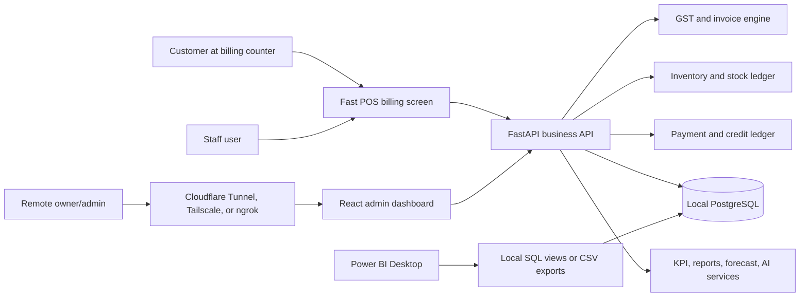

# Add-On Product Requirements Document

## Project Expansion Name

AI-Powered Hybrid Retail Billing, POS, GST, Inventory, Analytics, and Remote Order Management System

## Relationship To Existing Project

This document is an add-on PRD for the existing project:

`AI-Powered Hybrid Retail Inventory, Sales Analytics, and Remote Order Management System`

The existing PRD remains the product foundation. This add-on PRD expands the current system into a more complete Indian retail billing and business management product that can compete with Hitech BillSoft-style software while keeping the current strengths:

- Local-first database
- Remote admin dashboard
- FastAPI backend
- React dashboard
- PostgreSQL
- Role-based access control
- Inventory ledger
- Sales analytics
- Purchase order workflow
- Forecasting
- AI assistant
- Power BI support
- Backup and remote access documentation

The goal is not to clone any competitor exactly. The goal is to build a stronger portfolio and product direction by combining practical Indian shop billing features with modern analytics, AI, and hybrid architecture.

## Public Competitor Benchmark

Benchmark reviewed: Hitech BillSoft public website pages as of 2026-05-21.

Useful public references:

- https://billingsoftwareindia.in/features/
- https://www.billingsoftwareindia.in/features/sale-management/
- https://www.billingsoftwareindia.in/features/purchase-management/
- https://billingsoftwareindia.in/services/retail-shop-billing-software/
- https://billingsoftwareindia.in/services/barcode-billing-software/
- https://www.billingsoftwareindia.in/pricing/
- https://www.billingsoftwareindia.in/advantages/
- https://www.billingsoftwareindia.in/features/new/

Observed competitor strengths from public pages:

- GST and Non-GST invoices
- Multi-rate invoices
- A4, A5, and POS receipt invoice sizes
- Fast POS billing
- Barcode read, generate, print, serial number, and batch support
- Purchase bills and purchase returns
- Supplier ledgers and payments
- Customer/client management
- Credit sales and customer credit limits
- Payment tracking and adjustments
- Expense tracking
- GST reports such as GSTR-1 and GSTR-3B
- E-invoice and e-way bill support in higher plans
- SMS, email, and WhatsApp style sharing
- Automated backup
- Web-based reports
- Staff accounts, access rights, attendance, salary, and commissions
- Online store and ecommerce add-on
- Multiple company support
- Restaurant/manufacturing modules in paid tiers

Existing project strengths:

- Modern web dashboard
- Clean API-driven architecture
- Local PostgreSQL data model
- Remote admin access while keeping database private
- Strong inventory ledger rules
- Reorder recommendation formula
- Purchase order approval and receiving lifecycle
- Forecasting
- AI assistant with database-backed tools
- Power BI reporting support
- QA and portfolio documentation

Strategic conclusion:

The current project already beats a traditional billing app in analytics, AI, architecture, and portfolio value. To match and beat Hitech-style software as a retail product, the next version must add POS billing, GST compliance workflows, barcode operations, customer/supplier ledger depth, payments, returns, printing, and Indian retail usability.

## Expansion Vision

Build a complete Indian retail business platform where a shop can bill customers quickly at the counter, print/share GST invoices, scan barcodes, manage customer credit, record purchases, track supplier payments, file GST-ready reports, and still use advanced dashboards, AI assistant, forecasting, Power BI, remote admin access, and local-first cost control.

The upgraded product should feel like:

- A fast POS billing system for shop staff
- A GST-ready invoicing and reporting system for owners/accountants
- A reliable inventory and purchase system for managers
- A remote business cockpit for admins
- An AI-powered business analyst for smarter decisions

## Product Positioning

Recommended positioning:

"A modern local-first retail ERP for Indian small and medium businesses, combining POS billing, GST invoicing, barcode inventory, purchase and ledger management, AI analytics, forecasting, Power BI reporting, and secure remote admin access."

Do not position it only as a billing software clone.

Position it as a next-generation retail operations system.

## High-Level Product Goals

1. Match practical Indian billing software expectations.
2. Preserve the existing local-first architecture.
3. Add GST-ready sales and purchase workflows.
4. Make sales counter billing fast enough for real retail use.
5. Add barcode, batch, serial, MRP, unit, and expiry support.
6. Add customer and supplier account ledgers.
7. Add payment tracking, credit sales, and outstanding balances.
8. Add returns, debit notes, and credit notes.
9. Add invoice printing and sharing.
10. Add GST reports and export formats useful to accountants.
11. Add optional e-invoice and e-way bill adapter design.
12. Use AI to go beyond the competitor with safe automation.
13. Strengthen reporting through dashboards, Power BI, and export views.
14. Improve packaging, backup, and offline reliability.

## Non-Goals For The Add-On MVP

These should not block the first competitive expansion:

- Direct production GST portal integration without proper GSP/legal review
- Native Android/iOS app
- Full accounting replacement like Tally
- Payroll compliance
- Biometric hardware integration
- Full ecommerce storefront with payment gateway
- Manufacturing BOM module
- Restaurant KOT/table module
- Multi-country tax engine

These can be later modules after the billing, GST, POS, and ledger foundations are stable.

## Add-On Gap Analysis

| Capability | Current Project | Hitech-Style Expectation | Add-On Direction |
| --- | --- | --- | --- |
| POS billing | Basic sales entry | Fast counter billing | Add barcode-first POS screen and invoice engine |
| GST invoices | Not deep | GST/Non-GST, multi-rate invoices | Add tax profile, HSN, GST rates, invoice tax rows |
| Invoice printing | Not primary | A4, A5, POS receipts | Add PDF/HTML print templates |
| Barcode | Not implemented | Scan, generate, print | Add product barcode, label generation, scanner input |
| Customer ledger | Not implemented | Customers, credit limits, receipts | Add customer accounts and ledger entries |
| Credit sales | Not implemented | Credit sale tracking | Add payment status, due amount, credit limit checks |
| Purchase bills | PO workflow only | Purchase bill, purchase return | Add purchase bill receiving and supplier ledger |
| Supplier ledger | Supplier master only | Supplier accounts/payments | Add supplier ledger, payments, adjustments |
| Payment modes | Limited sale total | Cash, UPI, card, wallet, cheque | Add payment split records and payment reconciliation |
| Returns | Movement type exists, no full flow | Sale/purchase returns | Add return documents and stock/tax/ledger effects |
| GST reports | Exports/Power BI | GSTR-style reports | Add GSTR-1, GSTR-3B summaries and CSV exports |
| E-invoice/e-way | Not implemented | Higher-plan feature | Add adapter-ready mock/sandbox workflow |
| SMS/email/WhatsApp | Not implemented | Invoice sharing | Add communication queue and provider abstraction |
| Backup | Manual docs/scripts | Automated backup | Add scheduled backup and restore UI guidance |
| Staff/commission | Roles only | Staff accounts, commission | Add commission rules and staff performance |
| Online store | Non-goal | Add-on | Future optional customer ordering portal |
| AI | Strong | Early virtual assistant | Expand AI into invoice, GST, reorder, and credit assistant |

## Combined Product Flow



Core rule remains unchanged:

Remote users access only the web dashboard/API. PostgreSQL stays local and private.

## New Business Flows

### Flow 1: Fast POS Billing

1. Staff opens POS screen.
2. Staff scans barcode or searches product.
3. System loads product, price, stock, tax, and batch/MRP if applicable.
4. Staff adds quantity and discount.
5. Backend validates stock and tax rules.
6. Backend calculates taxable value, CGST, SGST, IGST, cess, total, profit, and stock impact.
7. Customer pays by cash, UPI, card, wallet, credit, or split payment.
8. Backend creates invoice, invoice items, tax rows, payment rows, stock movements, customer ledger entries, and audit log.
9. System prints or shares invoice.

### Flow 2: GST Invoice Creation

1. Staff chooses GST or Non-GST invoice type based on business settings.
2. Backend reads seller GSTIN, place of supply, customer GSTIN, product HSN, GST rate, and branch state.
3. Backend decides CGST/SGST for intra-state sales or IGST for inter-state sales.
4. Backend stores invoice-level and line-level tax breakup.
5. Invoice is available for printing, sharing, reports, and GST exports.

### Flow 3: Credit Sale And Payment Collection

1. Staff selects customer.
2. Backend checks credit limit and outstanding balance.
3. Invoice can be marked full paid, partial paid, unpaid, or credit.
4. Customer ledger entry is created for invoice due amount.
5. Later payment receipt reduces outstanding balance.
6. Admin can view aging report and overdue customers.

### Flow 4: Sale Return And Credit Note

1. Staff opens original invoice.
2. Staff selects returned items and quantities.
3. Backend validates return quantity against original sale.
4. Backend increases inventory if goods are accepted back.
5. Backend creates return document, credit note, tax reversal rows, customer ledger adjustment, stock movement, and audit log.

### Flow 5: Purchase Bill And Supplier Ledger

1. Manager records a purchase bill or converts approved PO to purchase bill.
2. Backend validates supplier, products, HSN, tax, batch, MRP, expiry, and quantities.
3. Inventory increases only when goods are received.
4. Supplier ledger payable is created.
5. Supplier payment reduces outstanding payable.
6. Purchase return adjusts stock and supplier ledger.

### Flow 6: Barcode And Label Printing

1. Admin adds barcode to product or generates internal barcode.
2. System supports one barcode per product and optional multiple barcodes per variant/batch.
3. Staff scans barcode during POS billing.
4. Admin prints barcode labels using selected template size.

### Flow 7: GST Reports

1. Admin or analyst selects tax period.
2. Backend aggregates invoice and return tax rows.
3. System shows GST summary dashboard.
4. User exports GSTR-style CSV/Excel for CA review.
5. System flags missing GSTIN, missing HSN, invalid tax rate, and negative anomalies.

### Flow 8: E-Invoice And E-Way Bill Adapter

1. Admin marks invoice eligible for e-invoice or e-way bill.
2. Backend validates required fields.
3. MVP generates a structured JSON payload and marks it "ready for portal/GSP".
4. Later production version connects through a configurable GSP provider.
5. System stores IRN, acknowledgement number, QR data, e-way bill number, validity, and status when available.

### Flow 9: AI-Assisted Operations

1. Admin asks: "Prepare GST summary for this month."
2. AI calls GST report tools and returns actual values.
3. Staff asks: "Create invoice for 2 Amul milk and 1 bread for Raj."
4. AI prepares a draft invoice only.
5. User confirms before invoice is saved.
6. AI never invents business numbers and never performs write actions without confirmation.

## Phased Execution Plan

### Phase 0: Competitive Baseline And Compliance Planning

Goal:
Document exact scope, compliance assumptions, and current system impact before coding.

Tasks:

- Read original PRD and this add-on PRD.
- Review current models and services.
- Decide whether `sales` remains the core document or whether new `invoices` wrap sales.
- Define tax calculation assumptions.
- Define India GST data fields.
- Create migration plan.
- Add compliance disclaimer to docs.

Acceptance:

- Architecture decision recorded.
- No existing business rule is broken.
- Agent knows the sequence before implementation starts.

### Phase 1: Business Profile, Tax, And Invoice Settings Foundation

Goal:
Add company, branch, GST, invoice numbering, payment mode, and tax setup.

New entities:

- companies
- business_profiles
- gst_registrations
- tax_rates
- invoice_sequences
- payment_modes
- print_templates
- fiscal_periods

Important fields:

- legal business name
- trade name
- GSTIN
- PAN
- state code
- address
- invoice prefix
- invoice reset rule
- default tax mode
- default currency INR

Acceptance:

- Admin can configure business profile.
- Backend can generate next invoice number safely.
- Tax rates are stored in database, not hardcoded only in UI.

### Phase 2: Product Catalog Upgrade For Indian Retail

Goal:
Upgrade products for GST, barcode, MRP, unit, batch, serial, and expiry support.

Product additions:

- HSN/SAC code
- GST rate
- cess rate
- primary barcode
- alternate barcodes
- unit of measure
- MRP
- sale price tiers
- batch tracking flag
- serial tracking flag
- expiry tracking flag
- item type: goods/service
- brand
- manufacturer

New entities:

- product_barcodes
- product_units
- product_price_history
- inventory_batches
- serial_numbers

Acceptance:

- Products can be searched by name, SKU, or barcode.
- Product form supports HSN, GST, MRP, barcode, and unit.
- Inventory can optionally be tracked by batch/expiry.

### Phase 3: Customer Management And Customer Ledger

Goal:
Add customer accounts, credit sales, receipts, and outstanding balances.

New entities:

- customers
- customer_addresses
- customer_ledger_entries
- customer_payments
- customer_credit_limits

Customer fields:

- name
- phone
- email
- GSTIN
- billing address
- shipping address
- state
- credit limit
- opening balance
- active status

Acceptance:

- Admin can create/edit customers.
- Staff can select customer during sale.
- Customer outstanding balance is calculated from ledger entries.
- Credit limit can block or warn before credit sale.

### Phase 4: Invoice And POS Billing Backend

Goal:
Create a production-style invoice engine while preserving existing sales analytics.

New entities:

- invoices
- invoice_items
- invoice_taxes
- invoice_payments
- invoice_status_history

Invoice statuses:

- draft
- issued
- paid
- partial_paid
- credit
- cancelled
- returned

Backend APIs:

- GET /invoices
- POST /invoices
- GET /invoices/{id}
- POST /invoices/{id}/issue
- POST /invoices/{id}/cancel
- POST /invoices/{id}/payments
- GET /pos/products/search
- POST /pos/checkout

Business rules:

- Backend calculates all invoice totals.
- Invoice issue reduces inventory.
- Every stock reduction creates stock movement.
- Invoice cannot be issued with insufficient stock unless negative stock is explicitly enabled.
- Invoice number must be unique per branch/company/year sequence.
- Tax rows must be stored for reporting.

Acceptance:

- Staff can create and issue invoice through API.
- Inventory decreases.
- Payments are stored.
- Customer ledger updates for credit/partial payments.
- Sales dashboards still work from invoice/sale data.

### Phase 5: Fast POS Frontend

Goal:
Build a counter-friendly POS screen.

UI requirements:

- Barcode input focused by default.
- Product search by barcode, SKU, or name.
- Cart with quantity, discount, tax, total.
- Customer selector.
- Payment mode selector.
- Split payment support.
- Hold invoice/draft invoice.
- One-click checkout for cash sale.
- Print/share action after invoice.
- Keyboard-friendly flow.

Acceptance:

- Staff can complete a normal invoice quickly.
- Barcode scanner input behaves like keyboard input.
- Backend remains source of truth.
- POS screen is operational, not a marketing page.

### Phase 6: Invoice Print, PDF, And Receipt Templates

Goal:
Support professional invoices and POS receipts.

Templates:

- A4 GST invoice
- A5 invoice
- 58mm POS receipt
- 80mm POS receipt
- Non-GST invoice
- Credit note
- Purchase bill

Features:

- Business logo
- GSTIN
- HSN
- tax breakup
- QR placeholder
- terms and conditions
- customer details
- payment details
- print preview
- PDF download

Acceptance:

- Issued invoice can be printed/downloaded.
- POS receipt is readable on thermal receipt width.
- Tax breakup appears correctly.

### Phase 7: Payments, Credit, And Cash Register

Goal:
Track real money flow, payment modes, and daily closing.

New entities:

- cash_register_sessions
- payment_transactions
- payment_reconciliations
- drawer_movements

Payment modes:

- cash
- UPI
- card
- bank transfer
- wallet
- cheque
- credit

Acceptance:

- Invoice can be fully paid, partially paid, or credit.
- Staff can open and close register shift.
- Admin can view payment summary by mode.
- Customer outstanding report is accurate.

### Phase 8: Sales Returns, Refunds, Credit Notes

Goal:
Handle post-sale corrections correctly.

Backend APIs:

- POST /sales-returns
- GET /sales-returns
- GET /sales-returns/{id}
- POST /credit-notes

Business rules:

- Return quantity cannot exceed sold quantity.
- Accepted return increases inventory.
- Damaged return can go to non-saleable stock if enabled.
- Tax reversal rows are stored.
- Customer ledger and payment/refund status update.

Acceptance:

- Sale return adjusts stock and ledger.
- Credit note can be printed.
- Dashboards account for returns.

### Phase 9: Purchase Bills, Purchase Returns, And Supplier Ledger

Goal:
Upgrade purchase order workflow into full purchase accounting support.

New entities:

- purchase_bills
- purchase_bill_items
- purchase_bill_taxes
- supplier_ledger_entries
- supplier_payments
- purchase_returns
- debit_notes

Business rules:

- PO creation still does not increase available stock.
- Purchase bill receiving increases stock.
- Purchase return decreases stock.
- Supplier payable is created from purchase bill.
- Supplier payment reduces payable.

Acceptance:

- Admin can create purchase bill manually or from PO.
- Supplier ledger shows purchases, payments, returns, and adjustments.
- Inventory and stock movements remain consistent.

### Phase 10: Expense Tracking And Basic Accounting Reports

Goal:
Add practical expense and profit visibility without becoming a full accounting system.

New entities:

- expense_categories
- expenses
- account_heads
- ledger_entries

Reports:

- daily profit summary
- expense summary
- payment mode summary
- customer receivable
- supplier payable
- gross profit by item
- cashbook

Acceptance:

- Admin can record expenses.
- Dashboard includes net contribution estimate.
- Ledger reports reconcile with invoice/payment records.

### Phase 11: GST Reporting And CA Exports

Goal:
Make the system useful for Indian tax reporting preparation.

Reports:

- GST sales register
- GST purchase register
- HSN summary
- tax liability summary
- GSTR-1 style outward supplies
- GSTR-3B style summary
- B2B, B2C, credit note, debit note sections
- missing GSTIN/HSN validation report

Exports:

- CSV
- Excel-compatible CSV
- JSON payload draft for future e-invoice/e-way integration

Acceptance:

- Admin can export tax-period GST summaries.
- Reports are generated from stored invoice tax rows.
- Missing/invalid tax data is flagged.

Compliance note:

GST rules and portal formats can change. Production use must be reviewed with a CA/GST expert and, for direct portal integration, a valid GSP/API provider.

### Phase 12: E-Invoice And E-Way Bill Adapter-Ready Workflow

Goal:
Prepare the product for e-invoice and e-way bill without hardcoding a paid provider.

Entities:

- einvoice_requests
- eway_bill_requests
- compliance_payloads

Workflow:

- Generate structured payload.
- Validate required fields.
- Store submission status.
- Allow manual entry of IRN/e-way bill number for MVP.
- Add provider interface for future GSP integration.

Acceptance:

- Eligible invoice can produce e-invoice/e-way-ready payload.
- Admin can record generated compliance identifiers manually.
- No secret credentials are committed.

### Phase 13: Barcode Label Generation

Goal:
Support barcode generation and label printing.

Features:

- Generate internal barcode.
- Store alternate supplier barcodes.
- Label templates.
- Batch label printing.
- Product name, MRP, barcode, and variant on label.

Acceptance:

- Admin can generate labels for selected products.
- POS can scan generated or supplier barcode.

### Phase 14: Bulk Import And Data Migration Tools

Goal:
Make onboarding realistic.

Imports:

- products
- customers
- suppliers
- opening stock
- price list
- barcode list

Exports:

- product catalog
- customers
- inventory
- invoices
- purchase bills

Acceptance:

- CSV import validates rows before writing.
- Errors are reported clearly.
- Duplicate SKU/barcode handling is safe.

### Phase 15: Communication And Invoice Sharing

Goal:
Send invoices and reminders through configurable channels.

Channels:

- email
- WhatsApp link/share
- SMS provider abstraction

Entities:

- communication_templates
- outbound_messages
- message_delivery_logs

Acceptance:

- Invoice can be shared by email or WhatsApp link.
- Payment reminder drafts can be generated.
- Provider credentials are optional and configured through environment variables.

### Phase 16: Automated Backup, Restore, And Local Reliability

Goal:
Improve the local-first reliability story.

Features:

- Scheduled backup script
- Backup status page
- Backup retention policy
- Restore documentation
- Optional encrypted backup archive
- Optional second backup location
- Startup health checks

Acceptance:

- Admin can see last backup status.
- Scripts still do not hardcode secrets.
- Database remains local by default.

### Phase 17: Advanced AI Business Copilot

Goal:
Beat traditional billing tools with safe AI automation.

AI tools:

- get_gst_summary
- get_customer_outstanding
- get_supplier_payables
- get_cash_register_summary
- get_invoice_profitability
- draft_invoice
- draft_purchase_bill
- draft_payment_reminder
- explain_tax_report
- detect_stock_anomalies
- suggest_discount_strategy

Guardrails:

- No invented numbers.
- All business values come from tools.
- Write actions require confirmation.
- GST/tax advice must be phrased as operational summary, not legal advice.
- Role and branch permissions apply to AI tools.

Acceptance:

- AI can answer GST, invoice, credit, stock, and payment questions using real data.
- AI can draft but not auto-issue invoices.
- AI can explain why a reorder or credit risk is flagged.

### Phase 18: Competitive Reporting Library

Goal:
Move from basic dashboards to a broad report center.

Report categories:

- sales
- inventory
- purchase
- customer receivable
- supplier payable
- GST/tax
- profit
- staff
- payment
- cash register
- reorder
- forecast

Acceptance:

- At least 30 high-value reports exist for MVP expansion.
- Reports can filter by date, branch, category, product, customer, supplier, payment mode, and staff.
- Reports can export CSV.
- Power BI views are updated.

### Phase 19: Staff Performance, Commission, And Access Rights

Goal:
Improve staff management without building full payroll.

Features:

- Staff profile
- Shift/session tracking
- Sales by staff
- Commission rules
- Staff access matrix

Acceptance:

- Admin can view sales by staff.
- Commission report can be calculated.
- Permission matrix is enforced in backend.

### Phase 20: Optional Online Store And Customer Ordering Portal

Goal:
Add ecommerce-style visibility only after POS and billing are strong.

Scope:

- Public product catalog
- Customer order request
- Admin order approval
- Convert online order to invoice
- Local stock availability shown carefully

Acceptance:

- Online order does not bypass stock or billing rules.
- Payment gateway is optional future work.

### Phase 21: Packaging, Demo, QA, And Portfolio Upgrade

Goal:
Make the upgraded product presentable and testable.

Tasks:

- Add architecture diagram for expanded product.
- Add demo script for POS + GST + AI.
- Add seed data with GST, customers, barcodes, payments, invoices, and returns.
- Add tests for invoice tax, stock update, returns, credit ledger, purchase bill, and GST reports.
- Add screenshots.
- Add interview talking points.

Acceptance:

- End-to-end demo works.
- Critical business tests pass.
- Documentation explains how this version competes with traditional billing software.

## New Data Model Summary

High-priority new tables:

- companies
- business_profiles
- gst_registrations
- tax_rates
- invoice_sequences
- payment_modes
- print_templates
- product_barcodes
- product_units
- product_price_history
- inventory_batches
- serial_numbers
- customers
- customer_addresses
- customer_ledger_entries
- customer_payments
- invoices
- invoice_items
- invoice_taxes
- invoice_payments
- sales_returns
- sales_return_items
- credit_notes
- purchase_bills
- purchase_bill_items
- purchase_bill_taxes
- purchase_returns
- debit_notes
- supplier_ledger_entries
- supplier_payments
- expenses
- expense_categories
- cash_register_sessions
- payment_transactions
- communication_templates
- outbound_messages
- einvoice_requests
- eway_bill_requests

Existing tables to extend:

- products
- inventory
- stock_movements
- sales
- sale_items
- purchase_orders
- purchase_order_items
- suppliers
- users
- branches
- audit_logs
- forecasts
- ai_chat_sessions
- ai_chat_messages

## Backend API Additions

Suggested new route groups:

```text
/business-profile
/tax-rates
/invoice-sequences
/customers
/customer-ledger
/payment-modes
/pos
/invoices
/invoice-prints
/sales-returns
/credit-notes
/purchase-bills
/purchase-returns
/supplier-ledger
/expenses
/gst-reports
/compliance
/barcodes
/cash-register
/communications
/report-center
```

## Frontend Page Additions

Suggested navigation additions:

- POS Billing
- Invoices
- Customers
- Customer Ledger
- Payments
- Cash Register
- Sales Returns
- GST Reports
- Barcode Labels
- Purchase Bills
- Supplier Ledger
- Expenses
- Report Center
- Business Profile
- Tax Settings
- Print Templates
- Communication Templates
- Backup Status

Existing pages to upgrade:

- Sales Summary should include invoices, returns, payment modes, and tax summary.
- Inventory should include barcode, batch, MRP, expiry, and valuation.
- Purchase Orders should connect to purchase bills.
- AI Assistant should gain GST, invoice, payment, and ledger tools.
- Power BI Reports should include GST, receivable, payable, and POS datasets.
- Settings should include business profile, tax, invoice sequence, print, backup, and communication settings.

## Business Rules

### Invoice And Stock Rules

- Issued invoices reduce available stock.
- Draft invoices do not reduce stock unless stock reservation is explicitly enabled.
- Cancelled draft invoices do not affect stock.
- Cancelled issued invoices require reversal or credit note policy.
- Sale returns increase stock only if returned goods are saleable.
- Every stock change creates a stock movement.
- Backend remains the source of truth for totals and stock changes.

### GST Rules

- Product tax details must come from stored product/tax configuration.
- HSN/SAC should be stored for taxable products/services.
- CGST and SGST apply for intra-state sales.
- IGST applies for inter-state sales.
- Tax rows must be stored at invoice item level.
- Reports must be generated from stored tax rows, not recalculated loosely from frontend totals.
- GST reports are operational aids and must be verified by a tax professional before filing.

### Payment And Ledger Rules

- Invoice can be paid, partially paid, unpaid, or credit.
- Credit sale creates customer receivable.
- Customer payment reduces receivable.
- Purchase bill creates supplier payable.
- Supplier payment reduces payable.
- Ledger entries should be append-only where practical.
- Adjustments require reason and audit log.

### Barcode Rules

- Barcode must be unique where configured as unique.
- Products can have alternate barcodes.
- POS barcode scan should not create product automatically.
- Unknown barcode shows clear error and optional "create product" action for authorized users.

### AI Rules

- AI cannot invent invoice, GST, stock, payment, or ledger numbers.
- AI must call backend tools for all numeric answers.
- AI can draft write actions but must ask confirmation before saving.
- AI cannot file GST returns or claim legal correctness.
- AI must respect role and branch permissions.

## Priority Plan

### Must Have To Match Hitech-Style Core

- POS billing
- GST/Non-GST invoice
- HSN and tax rates
- Barcode scanning
- Invoice print/PDF
- Customer management
- Credit sales
- Payment modes
- Purchase bills
- Supplier ledger
- Sale returns
- GST reports
- Backup status

### Must Have To Beat Traditional Billing Tools

- AI assistant with safe business tools
- Reorder recommendations connected to purchase workflow
- Forecasting
- Power BI reporting views
- Remote admin dashboard with local database privacy
- Strong backend tests for business rules
- Modern API-driven architecture

### Should Have

- Barcode label printing
- Split payments
- Cash register closing
- Expense tracking
- Customer payment reminders
- Purchase returns
- E-invoice/e-way payload generation
- Advanced report center

### Could Have Later

- Android app
- Online store
- Full accounting module
- Biometric attendance
- Staff salary payroll
- Loyalty program
- Restaurant KOT
- Manufacturing BOM

## Testing Phases For Expansion

1. Migration and seed test
2. Business profile and tax setup test
3. Product GST/barcode test
4. Customer ledger test
5. POS invoice creation test
6. Stock reduction and stock movement test
7. Payment and credit sale test
8. Invoice print/PDF test
9. Sale return and credit note test
10. Purchase bill and supplier ledger test
11. GST report export test
12. Barcode scan and label test
13. Cash register closing test
14. AI tool-backed answer test
15. Role and branch permission test
16. Backup status and restore documentation test
17. Power BI/export test
18. End-to-end demo test

## Expanded Demo Flow

1. Explain problem: Indian retailer needs billing, GST, stock, remote visibility, and low cost.
2. Show local-first architecture.
3. Log in as Admin.
4. Configure business GST profile.
5. Show product with HSN, GST, barcode, MRP, and stock.
6. Log in as Staff.
7. Open POS screen.
8. Scan/search products.
9. Create GST invoice with cash/UPI payment.
10. Print/download invoice.
11. Show inventory reduced and stock movement created.
12. Create credit sale for customer.
13. Show customer outstanding ledger.
14. Record customer payment.
15. Create sale return and credit note.
16. Show GST report for the month.
17. Create purchase bill or receive PO.
18. Show supplier payable ledger.
19. Ask AI: "Which customers have overdue balances?"
20. Ask AI: "Summarize this month's GST sales."
21. Ask AI: "Which items should I reorder today?"
22. Show forecasting and reorder dashboard.
23. Show Power BI/report center.
24. Explain how this beats traditional billing software through AI, analytics, and remote local-first design.

## Definition Of Done

The expansion is considered complete when:

- POS invoice can be created from UI and API.
- Invoice supports GST and Non-GST modes.
- Barcode product lookup works.
- Invoice print/PDF works for A4 and POS receipt.
- Customer credit sale and payment collection work.
- Customer ledger is accurate.
- Purchase bill and supplier ledger work.
- Sale return adjusts stock and ledger.
- GST summary reports export correctly.
- Inventory ledger remains reliable.
- AI assistant answers invoice, GST, stock, payment, and ledger questions from tools.
- Role permissions are enforced in backend.
- Seed data includes realistic GST, barcodes, customers, payments, invoices, and returns.
- Tests cover all critical financial and stock rules.
- Documentation and demo script are updated.

## Key Implementation Advice For AI Coding Agents

- Do not rewrite the existing MVP. Extend it in vertical slices.
- Keep the local-first architecture.
- Add schema and tests before complex UI.
- Treat tax, invoice, stock, and ledger operations as transactional.
- Never calculate invoice totals only in the frontend.
- Use append-only ledger design where possible.
- Keep GST/e-invoice/e-way bill provider integration configurable and optional.
- Preserve Power BI and AI features because these are the main "beat the competitor" differentiators.
- At the end of each phase, report files changed, commands run, tests passed, and known gaps.

