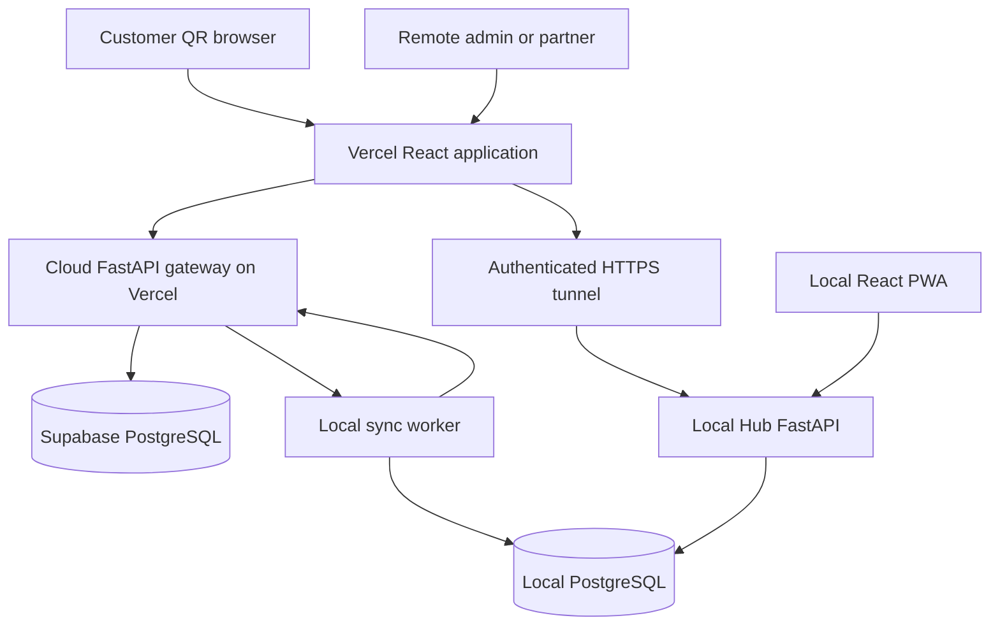

# Technical Requirements Document: Hybrid Cloud Continuity

## Document Status

- Version: 1.0
- Status: Approved technical contract; implementation not started
- Last updated: 2026-08-11
- Applies to: Vercel frontend/cloud API, Supabase coordination database, and Local Business Hub

## 1. Purpose And Precedence

This document implements `PRD_HYBRID_CLOUD_CONTINUITY_ADDENDUM.md`. It supersedes older topology statements that require exactly one application deployment or prohibit a cloud coordination database. It does not supersede local financial authority, venture isolation, transaction, tax, audit, or stock rules.

The architecture must provide at-least-once transport with idempotent consumers so that business effects are effectively applied once.

## 2. Approved Topology



The repository remains one codebase. It may expose two FastAPI entry points or one application factory configured by `DEPLOYMENT_MODE`:

- `local_hub`: complete operational APIs and local database access;
- `cloud_gateway`: public QR, synchronization, continuity, and approved cloud read APIs only.

Cloud deployment must not register local-only inventory adjustment, final billing, purge execution, database backup, or unrestricted reporting routes.

## 3. Data Authority And Storage Boundaries

### 3.1 Local Operational Database

The existing local PostgreSQL schema remains authoritative. New local synchronization tables should include:

- `sync_devices`;
- `sync_outbox`;
- `sync_inbox`;
- `sync_checkpoints`;
- `sync_dead_letters`;
- `sync_aggregate_versions`;
- `cloud_record_links`;
- `continuity_reconciliations`.

Outbox rows must be inserted in the same transaction as the domain change they describe. A committed domain change without its required outbox event is a release-blocking integrity failure.

### 3.2 Supabase Coordination Database

Use a dedicated private schema such as `coordination` for backend-only tables. Public Data API exposure is not required for backend-only records.

Expected cloud tables include:

- `device_registrations`;
- `device_heartbeats`;
- `writer_leases`;
- `published_menu_versions`;
- `published_menu_categories`;
- `published_menu_items`;
- `published_table_tokens` containing hashes, not raw QR secrets;
- `cloud_orders`;
- `cloud_order_items`;
- `cloud_order_events`;
- `cloud_idempotency_keys`;
- `sync_commands`;
- `sync_receipts`;
- `dashboard_snapshots`;
- `inventory_availability_snapshots`;
- `continuity_transactions`;
- `cloud_tombstones`.

Do not copy password hashes, cost prices, unrestricted customer data, full audit payloads, or raw QR secrets to the cloud coordination database.

### 3.3 Migration Separation

- Existing Alembic migrations continue to manage the Local Hub database.
- Cloud coordination migrations use a separate Alembic configuration or explicit migration branch.
- Local and cloud migration histories must never share one version table accidentally.
- Runtime Vercel connections use the Supabase serverless transaction pooler.
- Migration, backup, and administrative commands use the supported direct or session connection, not the serverless runtime pool.

## 4. Event Contract

Every synchronized message uses a versioned envelope:

```json
{
  "event_id": "uuid",
  "event_type": "cafe.order.submitted",
  "schema_version": 1,
  "source": "cloud_gateway",
  "source_device_id": null,
  "business_group_id": "uuid-or-stable-id",
  "company_id": "stable-id",
  "branch_id": "stable-id",
  "aggregate_type": "cafe_order",
  "aggregate_id": "uuid",
  "aggregate_version": 1,
  "idempotency_key_hash": "hash",
  "occurred_at": "UTC timestamp",
  "recorded_at": "UTC timestamp",
  "correlation_id": "uuid",
  "causation_id": null,
  "payload": {}
}
```

Rules:

- Use UUIDs for cross-database identities.
- Persist all timestamps in UTC and preserve business date separately.
- Never trust company, branch, price, tax, or authority fields solely because they appear in an event.
- Validate event schemas before processing.
- Reject unknown future schema versions into a durable attention state.
- Keep payloads minimal and exclude secrets.

## 5. Delivery And Processing Semantics

### 5.1 Producer

1. Begin the local or cloud database transaction.
2. Validate authorization, scope, idempotency, and domain state.
3. Apply the domain write or durable intake record.
4. Insert its outbox/event record.
5. Commit.
6. Return the durable reference.

Do not publish an event before its originating database transaction commits.

### 5.2 Consumer

1. Authenticate the source and validate the envelope.
2. Look up `event_id` in the inbox or receipt table.
3. If already committed, return the previous receipt.
4. Validate aggregate version and business preconditions.
5. Apply domain effects and insert the inbox receipt in one transaction.
6. Commit.
7. Acknowledge the source only after commit.

If the acknowledgment is lost, the source retries and step 3 prevents duplication.

### 5.3 Retry Policy

- Retry network errors, timeouts, `429`, and retryable `5xx` responses.
- Use exponential backoff with jitter and a configured maximum delay.
- Honor `Retry-After` where supplied.
- Do not retry permanent authorization, validation, scope, or unsupported-schema failures indefinitely.
- Move exhausted or permanent failures to a dead-letter state with correlation ID and safe diagnostic text.
- A manual retry creates an audit record and reuses the same event ID unless an explicit compensating event is required.

### 5.4 Ordering

Global queue ordering is not required. Ordering is required per aggregate.

- `aggregate_version` must increase monotonically.
- A future version waits until missing earlier versions arrive or moves to attention after a timeout.
- An older version is acknowledged as already superseded only when its business effect is proven committed.
- Financial and stock conflicts must never use last-write-wins.

## 6. Automatic Recovery

### 6.1 Local Process Restart

The Local Hub database, API, sync worker, local frontend server, and backup monitor must run under an operating-system service manager or equivalent container restart policy.

Startup order:

1. Start PostgreSQL and wait for a successful database health check.
2. Run only approved pending local migrations under a controlled deployment step.
3. Start the Local Hub API.
4. Load persisted sync device identity and checkpoints.
5. Validate cloud reachability and writer lease state.
6. Start inbound and outbound workers.
7. Drain pending work in bounded batches.
8. Mark the Hub healthy only after local API and queue state are readable.

No queue or checkpoint may depend only on process memory.

### 6.2 Connectivity Restoration

The worker continuously distinguishes:

- `healthy`;
- `local_only`;
- `cloud_only`;
- `recovering`;
- `degraded`;
- `attention_required`.

When connectivity returns, the worker must automatically:

1. refresh device authorization;
2. renew or validate its lease;
3. pull unacknowledged cloud events from its checkpoint;
4. process them idempotently;
5. push local outbox events;
6. reconcile aggregate versions and receipts;
7. update snapshots;
8. report remaining failures.

Manual export/import is not part of normal recovery.

### 6.3 Power Loss

Transactions must rely on PostgreSQL durability. The application must not acknowledge work that exists only in an in-memory task or browser state.

After power returns, automatic service startup and the persisted queue algorithm above resume from committed state. An event being processed at the instant of power loss will either:

- have committed with its receipt and be recognized on redelivery; or
- not have committed and be retried.

## 7. Cloud Continuity Mode

### 7.1 Heartbeat

- The Local Hub publishes a signed heartbeat at a configurable interval.
- Missing heartbeats mark the Hub unavailable but do not delete or reassign data.
- Public QR order intake remains active automatically.
- The UI shows stale snapshot age and `awaiting_cafe_confirmation` where appropriate.

### 7.2 Writer Lease And Fencing

Use a cloud coordinator row containing at least:

- branch or processing-scope ID;
- current mode;
- lease owner;
- monotonically increasing fencing epoch;
- lease expiry;
- last heartbeat;
- recovery state.

Every authoritative continuity command carries the current fencing epoch. A stale epoch is rejected.

Public order intake does not require financial-writer authority because it creates no invoice, payment, ledger, or stock effect. Emergency financial processing must use a separately approved continuity workflow, reserved numbering rules, and reconciliation state.

### 7.3 Recovery From Continuity

1. The recovered Hub enters `recovering`, not immediately `healthy`.
2. It reads the active fencing epoch and continuity window.
3. It imports cloud orders and continuity records exactly once.
4. It applies local financial and stock effects under existing transactions.
5. It publishes receipts and reconciled identifiers.
6. It verifies queue counts and aggregate versions.
7. It obtains a new local-writer lease.
8. It returns to normal mode.

## 8. API Boundaries

### 8.1 Cloud Gateway APIs

Cloud deployment may provide:

- public QR resolve, menu, order submission, order status, and bill-request APIs;
- device registration and heartbeat APIs;
- pull-command and push-event synchronization APIs;
- cloud continuity queue APIs;
- timestamped dashboard snapshot APIs;
- health and readiness endpoints.

### 8.2 Local Hub APIs

Local deployment retains:

- authentication and operational role enforcement;
- full Retail and Cafe operations;
- inventory, final invoice, payment, ledger, purchase, return, closing, AI, export, and governance APIs;
- synchronization administration and reconciliation APIs.

### 8.3 Frontend Routing

The frontend API layer must distinguish cloud-safe and local-authoritative calls. Recommended logical prefixes:

- `/api/cloud/*` for Vercel cloud gateway;
- `/api/ops/*` for the Local Hub through a secure tunnel while online;
- `/api/local/*` or same-origin `/api/*` for the local PWA.

Do not implement silent fallback of a financial write from local to cloud. The user must see when a workflow changes to continuity semantics.

## 9. Authentication And Security

- Keep raw Supabase service-role and database credentials only in Vercel server-side environment variables.
- Do not include secret keys in `VITE_*` variables.
- Use a private Supabase schema for coordination data where practical.
- If a table is exposed through the Data API, enable RLS and create business-group, company, branch, subject, and action policies.
- Views exposed to clients must use security-invoker behavior or remain unexposed.
- Device credentials are independently revocable and scoped to one installation and allowed ventures/branches.
- Sign sync requests or use short-lived device tokens with replay protection.
- Rotate device credentials without losing queued data.
- Replace process-memory-only logout invalidation with persistent session or token-version state before multiple backend instances validate privileged users.
- Apply rate limits to QR resolve, order submit, heartbeat, synchronization, login, and recovery actions.
- Use TLS for all cloud and tunnel communication.

## 10. Configuration

Expected server-side settings include:

- `DEPLOYMENT_MODE=local_hub|cloud_gateway`;
- `LOCAL_DATABASE_URL`;
- `CLOUD_RUNTIME_DATABASE_URL`;
- `CLOUD_MIGRATION_DATABASE_URL`;
- `SYNC_DEVICE_ID`;
- `SYNC_DEVICE_SECRET` or key reference;
- `SYNC_BATCH_SIZE`;
- `SYNC_POLL_INTERVAL_SECONDS`;
- `SYNC_MAX_RETRY_DELAY_SECONDS`;
- `HEARTBEAT_INTERVAL_SECONDS`;
- `WRITER_LEASE_SECONDS`;
- configured Vercel and local/tunnel origins.

The frontend may use separate public cloud and operational API base URLs. Environment templates must explain which values are public and which are secrets.

## 11. Observability

Record and expose safe operational metrics:

- Local Hub last heartbeat;
- last successful inbound and outbound synchronization;
- pending inbound and outbound counts;
- oldest pending age;
- retry and dead-letter counts;
- current mode and fencing epoch;
- stale snapshot age;
- reconciliation status;
- software and event-schema versions.

Logs must use correlation IDs and must not contain database credentials, device secrets, raw tokens, payment secrets, or unnecessary PII.

## 12. Testing Requirements

Release-blocking automated and manual tests include:

1. Internet fails before a local transaction begins.
2. Internet fails after local commit but before cloud acknowledgment.
3. Power fails while an inbound event is being processed.
4. Power fails after commit but before receipt delivery.
5. The same order event is delivered many times.
6. Events arrive out of order for one aggregate.
7. A stale worker uses an old fencing epoch.
8. Cloud order intake continues while the Hub is offline.
9. The Hub restarts and drains both queues automatically.
10. Queue drain does not duplicate invoice, payment, ledger, or stock effects.
11. Retail and Cafe events cannot cross company scope.
12. A Cafe Partner cannot obtain Retail snapshots or sync metadata.
13. Revoked device credentials fail closed.
14. Unknown event schema versions remain durable and visible.
15. A dead-letter retry is audited.
16. Local backup and restore preserve pending outbox, inbox, and checkpoint state.
17. Supabase restore or cloud rebuild can reconstruct required coordination state from local authority and retained cloud events.

Use failure injection around transaction commits and acknowledgment delivery. A happy-path browser test alone is insufficient.

## 13. Local Installation Profile

A native desktop shell is optional. The supported MVP Local Hub profile is:

- PostgreSQL running as a managed service;
- FastAPI Local Hub running as a managed service;
- synchronization worker running as a managed service;
- built React PWA served locally;
- local hostname or shortcut for staff;
- scheduled backup and backup-age monitor;
- automatic restart on failure and operating-system startup.

Hardware printer or cash-drawer automation may add a local print bridge later without changing the data authority model.

## 14. Deployment And Cost Notes

- Vercel hosts the public frontend and limited cloud gateway.
- Supabase hosts the coordination database, not the authoritative inventory database.
- A secure tunnel exposes only selected Local Hub APIs and never PostgreSQL.
- Free tiers may be used for development or portfolio testing subject to provider terms and limits.
- Production operation must use provider plans and backup practices appropriate for commercial reliability.
- Local and cloud backups have separate schedules and restore tests.

## 15. Technical Definition Of Done

- Two deployment profiles build from one repository without exposing local-only routes in cloud mode.
- Local and cloud schemas have independent migrations.
- Outbox writes are transactional with their local domain effects.
- Consumers are idempotent and acknowledge only after commit.
- Restart and reconnect resume from durable checkpoints automatically.
- Cloud QR intake survives Local Hub outage.
- Writer lease and fencing prevent split-brain effects.
- Recovery drains queues and returns to normal mode without duplicate business effects.
- Security, isolation, failure-injection, backup, restore, and browser tests pass.
- Runbooks cover installation, outage states, reconciliation, device replacement, and key rotation.

