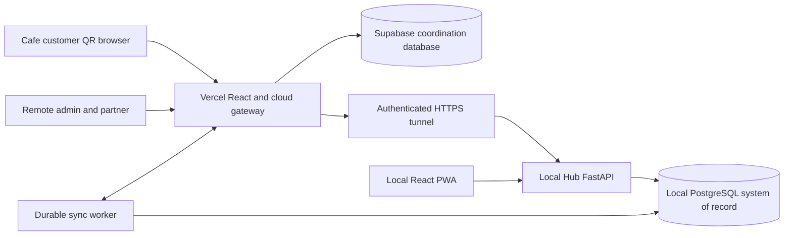
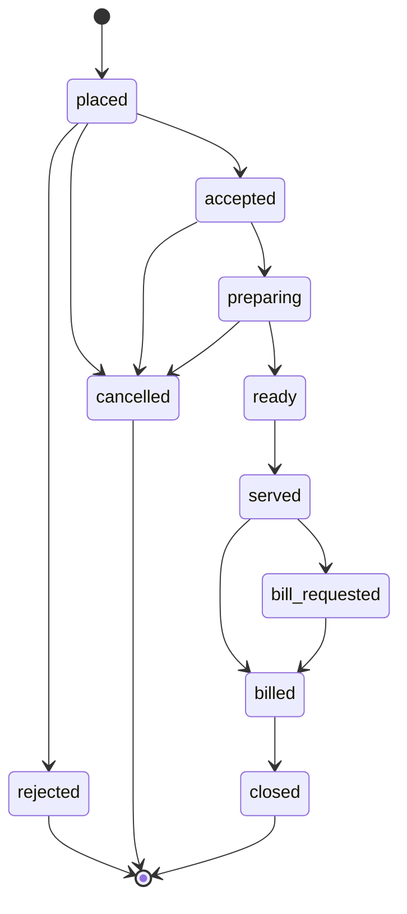

# Technical Requirements Document: Multi-Venture Retail And Cafe Expansion

## Document Status

- Version: 1.1
- Status: Approved technical baseline with hybrid cloud continuity addendum; implementation not started
- Last updated: 2026-08-11
- Applies to: Existing FastAPI, React, local PostgreSQL, Vercel, and Supabase architecture

## 1. Purpose

This document defines how to implement the requirements in `PRD_MULTI_VENTURE_CAFE_EXPANSION.md` without weakening the existing Retail product. It is the technical contract for:

- ownership, venture, branch, and user hierarchy;
- cross-venture data isolation;
- Cafe menu, table, QR, session, order, and billing flows;
- separate portal experiences on one application URL;
- GST-ready, Non-GST-default behavior;
- owner consolidation and Cafe partner restriction;
- audit, reversal, controlled purge, and business-day closing;
- hybrid cloud coordination and automatic outage recovery as defined by the continuity addendum;
- migration, security, test, and release strategy.

Implementation must follow `docs/MULTI_VENTURE_CAFE_IMPLEMENTATION_PHASES.md` and use the matching standalone prompt in `AGENT_STEP_BY_STEP_PROMPTS_MULTI_VENTURE_CAFE.md`. Do not implement later phases early unless a small compatibility change is explicitly required and tested.

## 2. Current Technical Baseline

### 2.1 Existing Stack

| Layer | Existing technology | Expansion decision |
| --- | --- | --- |
| Backend | FastAPI, Python | Preserve |
| ORM | SQLAlchemy | Preserve |
| Migrations | Alembic | Preserve |
| Database | Local PostgreSQL | Preserve as financial and inventory system of record |
| Cloud coordination | Not yet implemented | Add Supabase PostgreSQL with separate schema and migrations |
| Frontend | React, TypeScript, Vite | Preserve |
| Charts | Recharts | Preserve |
| Authentication | Bearer token with database user lookup | Extend with venture scope and step-up controls |
| Reporting | API dashboards, CSV, SQL views, Power BI | Add venture-aware views |
| AI | Database-backed tool router | Add venture-aware Cafe tools later |
| Remote access | Tunnel/private network documentation | Add Vercel cloud gateway and preserve tunnel for selected Local Hub APIs; never expose PostgreSQL |

### 2.2 Existing Extension Points

The current repository already has:

- `Company`, `BusinessProfile`, `GSTRegistration`, `TaxRate`, `InvoiceSequence`, `PaymentMode`, and `PrintTemplate`.
- Branch-scoped users and authorization helpers in `backend/app/api/deps.py`.
- Products, inventory, stock movement, sales, invoices, payments, customers, purchase orders, forecasts, AI, dashboards, and exports.
- A single-company assumption in several services and a global-access interpretation for current `ADMIN` and `ANALYST` roles.

The first implementation priority is removing those single-company assumptions safely. Cafe features must not be added until company scope is enforced across the existing APIs.

## 3. Architecture Decision

### 3.1 Deployment Topology

Use one repository with Local Hub and cloud gateway deployment profiles. The detailed synchronization and continuity topology is controlled by `TRD_HYBRID_CLOUD_CONTINUITY.md`:



No Redis or separate message broker is required for the MVP. PostgreSQL-backed outbox, inbox, receipt, and checkpoint records provide durable coordination. Supabase must not become a competing stock or financial authority.

### 3.2 Domain Hierarchy

Use this fixed hierarchy:

```text
BusinessGroup -> Company (venture) -> Branch -> Operational records
```

- `BusinessGroup` represents the common partnership/ownership context.
- Existing `Company` becomes the venture/workspace boundary.
- `Branch` remains the physical outlet boundary.
- Normal users belong to one company.
- Final Super Admin belongs to the business group and has global scope.

This one-parent model provides consolidated reporting and aggregate-turnover monitoring without implementing a general multi-tenant SaaS membership system.

## 4. Authorization Architecture

### 4.1 Roles

Extend `UserRole` to:

```text
super_admin
admin
store_manager
staff
order_taker
kitchen
analyst
```

Meaning:

- `super_admin`: global business-group owner.
- `admin`: Venture Admin; company-wide access within one venture.
- `store_manager`: branch operational manager.
- `staff`: existing Retail staff.
- `order_taker`: Cafe order entry and optional cashier actions.
- `kitchen`: Cafe preparation queue only.
- `analyst`: read-only within one company or assigned branch.

The Cafe partner uses role `admin`, `company_id=<cafe company>`, and no Retail membership.

### 4.2 Scope Context

Replace isolated branch-only decisions with one immutable request context:

```python
@dataclass(frozen=True)
class ScopeContext:
    user_id: int
    role: UserRole
    business_group_id: int
    company_id: int | None
    all_companies: bool
    branch_ids: tuple[int, ...]
    permissions: frozenset[str]
```

Rules:

1. The backend reloads the active user and assignments from the database on each authenticated request or from a safely invalidated short cache.
2. The client must never be trusted to provide authoritative `company_id`, role, or branch membership.
3. A normal user must have `company_id` and may access only records in that company.
4. Only `super_admin` may have `all_companies=True`.
5. A branch filter must first be verified as belonging to the current company and allowed branch set.
6. Object retrieval must query by both object identifier and scope. Do not load by `id` and check only after serialization.

Example required pattern:

```python
statement = select(Invoice).where(
    Invoice.id == invoice_id,
    Invoice.company_id == scope.company_id,
)
```

### 4.3 Permission Matrix

| Capability | Super Admin | Venture Admin | Manager | Retail Staff | Order Taker | Kitchen | Analyst | QR Guest |
| --- | --- | --- | --- | --- | --- | --- | --- | --- |
| Switch ventures | Yes | No | No | No | No | No | No | No |
| Consolidated reports | Yes | No | No | No | No | No | No | No |
| Cafe full dashboard | Yes | Own company | Own branch | No | Limited | No | Read-only scope | No |
| Retail modules | Yes | Own company if Retail | Own branch if Retail | Own branch | No | No | Read-only scope | No |
| Manage Cafe menu/tables | Yes | Own company | Own branch | No | Read only | No | Read only | No |
| Place Cafe order | Yes | Own company | Own branch | No | Own branch | No | No | Own QR session |
| Update preparation | Yes | Own company | Own branch | No | Allowed states | Own branch states | No | No |
| Bill and collect | Yes | Own company | Own branch | Existing Retail only | If cashier permission | No | No | Request bill only |
| Activate GST | Yes with validation | No by default | No | No | No | No | No | No |
| Void issued record | Yes | Policy-based own company | Limited approval | No | No | No | No | No |
| Permanent purge | Controlled | No | No | No | No | No | No | No |

Fine-grained permissions such as `cafe.collect_payment` may be stored as fixed role-policy mappings. A dynamic permission builder is deferred.

### 4.4 Non-Disclosure Behavior

- Cross-company object access should normally return `404 resource_not_found` to avoid confirming another venture's record exists.
- Explicit route-level denial such as a Cafe user opening `/api/super-admin/*` returns `403 forbidden`.
- Search, counts, pagination totals, exports, AI, and validation messages must not leak another company's values.
- Audit logs must include denied high-risk access attempts without echoing secret values.

## 5. Data Model Changes

### 5.1 New Ownership Table

#### `business_groups`

| Column | Type | Notes |
| --- | --- | --- |
| id | bigint/int PK | Internal identifier |
| name | varchar | Display name |
| legal_name | varchar nullable | Partnership/legal owner name |
| pan | varchar nullable | Sensitive; restricted display |
| default_currency | char(3) | `INR` |
| is_active | boolean | Soft lifecycle |
| created_at / updated_at | timestamp tz | Standard timestamps |

Indexes/constraints:

- Unique normalized group name where practical.
- PAN validation is format assistance only, not legal verification.

### 5.2 Existing `companies` Changes

Add:

| Column | Type | Notes |
| --- | --- | --- |
| business_group_id | FK, non-null after backfill | Ownership parent |
| business_type | enum | `retail`, `cafe` |
| slug | varchar | Stable route/display key, unique within group |
| is_demo | boolean | Enables demo-only reset behavior |

`Company` remains the venture/workspace boundary. Existing business profiles, payment modes, invoice sequences, print templates, and GST registrations continue to reference company.

### 5.3 Existing `branches` Changes

Add non-null `company_id` after backfill.

Change uniqueness from global branch name to:

```text
UNIQUE(company_id, normalized_name)
```

Every branch-company relationship must match all branch-scoped operational records.

### 5.4 Existing `users` Changes

Add:

| Column | Type | Notes |
| --- | --- | --- |
| business_group_id | FK, non-null | Owner group |
| company_id | FK nullable | Null only for Super Admin |
| role | extended enum | Includes new roles |
| token_version | integer | Increment to revoke existing sessions after scope/role change |
| last_login_at | timestamp nullable | Security visibility |
| failed_login_count | integer | Throttling support |
| locked_until | timestamp nullable | Temporary lockout |

Constraints:

- `super_admin` requires `company_id IS NULL` and `branch_id IS NULL`.
- Every other role requires `company_id IS NOT NULL`.
- A user's `branch_id`, when present, must belong to `company_id` at service validation level and preferably through a composite FK where practical.

Migration behavior:

- Promote the existing seeded global Admin to `super_admin`.
- Assign all other existing users to the Retail company.
- Create a separate Cafe Venture Admin seed account.
- Invalidate old tokens after role/scope migration.

### 5.5 Company Scope On Existing Data

Add or make non-null `company_id` on top-level confidential/operational records, including:

- categories
- suppliers
- products
- inventory
- stock_movements
- customers
- customer ledger entries and payments where direct scope improves safety
- sales
- invoices
- purchase_orders
- forecasts
- AI chat sessions
- audit_logs

Child rows such as invoice items may derive scope from the parent, but service joins must always anchor on the scoped parent. Direct `company_id` can be added to high-volume children when it materially improves safe filtering and indexes.

Scope-sensitive uniqueness becomes company-specific where appropriate:

- `UNIQUE(company_id, sku)`
- `UNIQUE(company_id, barcode)`
- `UNIQUE(company_id, supplier_name)` where enforced
- `UNIQUE(company_id, invoice_number)`
- `UNIQUE(company_id, branch_id, table_number)`
- customer phone/email/GSTIN uniqueness must be company-aware rather than global unless a deliberate global identity feature is later added.

### 5.6 Cafe Tables

#### `cafe_tables`

| Column | Type | Notes |
| --- | --- | --- |
| id | PK | Internal ID |
| company_id | FK | Must identify Cafe company |
| branch_id | FK | Cafe outlet |
| code | varchar | Human-readable table code |
| display_name | varchar | Customer display name |
| capacity | integer nullable | Optional |
| area | varchar nullable | Indoor, outdoor, floor, etc. |
| is_active | boolean | Operational state |
| version | integer | Optimistic concurrency |
| timestamps | timestamp tz | Standard |

Constraints:

- Unique `(branch_id, code)`.
- Company must match branch company.

#### `table_qr_tokens`

| Column | Type | Notes |
| --- | --- | --- |
| id | PK | Internal ID |
| company_id / branch_id / table_id | FK | Explicit scope |
| public_id | UUID | Non-secret lookup reference if split token is used |
| token_hash | varchar | SHA-256 or keyed hash of secret token; never store raw token |
| token_prefix | varchar | Small non-secret support identifier |
| expires_at | timestamp nullable | Optional rotation expiry |
| revoked_at | timestamp nullable | Revocation |
| created_by | FK user | Audit |
| last_used_at | timestamp nullable | Operational monitoring |
| created_at | timestamp tz | Standard |

Only a newly generated raw token is rendered into the QR. API responses must never return `token_hash`.

### 5.7 Cafe Menu

#### `menu_categories`

- id
- company_id
- branch_id nullable for company-wide menu
- name
- display_order
- is_active
- timestamps

Unique normalized name within `(company_id, branch_id)`.

#### `menu_items`

- id
- company_id
- branch_id nullable
- menu_category_id
- product_id nullable
- name
- description
- image_path/url nullable
- selling_price
- customer_display_price
- preparation_area enum: `kitchen`, `beverage`, `counter`, `none`
- is_available
- is_active
- display_order
- version
- timestamps

Rules:

- Price is non-negative.
- Product link, when present, must reference the same company.
- Customer display availability is calculated by backend policy.
- Do not create a second product catalog when a linked sellable product is appropriate.

### 5.8 Table Sessions

#### `table_sessions`

- id
- public_id UUID
- company_id
- branch_id
- table_id nullable for non-table sessions
- session_type enum: `dine_in`, `takeaway`, `counter`
- status enum: `open`, `bill_requested`, `billed`, `closed`, `cancelled`
- opened_by nullable user FK
- opened_at
- bill_requested_at nullable
- billed_invoice_id nullable
- closed_by nullable user FK
- closed_at nullable
- version
- timestamps

PostgreSQL partial unique index:

```text
UNIQUE(table_id) WHERE status IN ('open', 'bill_requested', 'billed')
```

This prevents two active billable sessions for one table.

Guest access should use a separate random short-lived secret stored as a hash, or a signed guest token tied to `public_id`, token version, and expiration. A sequential session ID is never sufficient.

### 5.9 Cafe Orders

#### `cafe_orders`

- id
- public_id UUID
- company_id
- branch_id
- table_session_id nullable for standalone takeaway if a session is not used
- order_number
- order_type enum: `dine_in`, `takeaway`, `counter`
- source_channel enum: `qr_customer`, `order_taker`, `billing_counter`, `manager`
- status enum: `placed`, `accepted`, `preparing`, `ready`, `served`, `bill_requested`, `billed`, `closed`, `rejected`, `cancelled`
- subtotal
- discount_total
- estimated_total
- customer_notes nullable
- created_by nullable user FK
- accepted_by nullable user FK
- billed_invoice_id nullable
- idempotency_key_hash nullable
- version
- timestamps for placed/accepted/served/cancelled

Unique constraints:

- `(company_id, order_number)`
- `(company_id, idempotency_key_hash)` when present and active for the retention window

#### `cafe_order_items`

- id
- cafe_order_id
- menu_item_id
- product_id nullable
- menu_item_name_snapshot
- product_sku_snapshot nullable
- quantity
- unit_price_snapshot
- discount_amount
- line_total
- item_status
- preparation_notes nullable
- source_channel
- created_by nullable
- billed_invoice_item_id nullable
- version
- timestamps

Price and totals are server-generated snapshots. A billed item cannot be linked to another invoice item.

#### `cafe_order_status_history`

- id
- company_id
- cafe_order_id
- from_status nullable
- to_status
- changed_by nullable
- guest_action boolean
- reason nullable
- created_at

This table is append-only through the application.

### 5.10 Invoice Source Link

Extend `invoices` with:

- `company_id` non-null
- `source_type` enum: `retail_pos`, `retail_sale`, `cafe_table_session`, `cafe_takeaway`, `manual`
- `source_id` nullable
- `idempotency_key_hash` nullable

Use a unique constraint/index that prevents more than one active invoice for the same Cafe billing source. A cancelled/voided invoice must follow explicit rebilling rules; it must not simply release uniqueness without history.

### 5.11 Tax Operation Settings

Preserve existing product HSN/SAC and reference GST rates. Add venture configuration as needed:

- `tax_registration_status`: `unregistered`, `registered`
- `default_tax_mode`: existing `non_gst`, `gst`
- `gst_effective_from` nullable
- `customer_details_on_bill`: `hidden`, `basic`, `full`
- `b2b_gst_enabled` boolean
- `include_customer_in_gst_reports` boolean default false

Server invariants:

1. `default_tax_mode=gst` requires registered status, active GST registration, state code, effective date, and invoice sequence.
2. GST invoice date cannot be before `gst_effective_from`.
3. Non-GST invoice tax totals are zero.
4. Product reference rates do not generate invoice tax rows in Non-GST mode.
5. Historical invoice snapshots are immutable when settings change.
6. Only Super Admin may activate registration status by default.

### 5.12 Governance Tables

#### `business_day_closures`

- company_id, branch_id, business_date
- opening_cash, cash_sales, cash_refunds, cash_expenses
- expected_cash, counted_cash, variance
- status: `open`, `submitted`, `closed`, `reopened`
- submitted_by, closed_by, reopened_by
- reasons and timestamps

Unique `(branch_id, business_date)`.

#### `record_purge_requests`

- id, public_id
- business_group_id, company_id, branch_id nullable
- entity_type, entity_id nullable
- scope_json for controlled bulk request
- reason
- status: `draft`, `pending_approval`, `approved`, `executing`, `completed`, `rejected`, `failed`
- requested_by, approved_by nullable, executed_by nullable
- backup_reference and backup_verified_at
- dependency_report_json
- requested_at, approved_at, executed_at

#### `record_tombstones`

- id
- purge_request_id
- business_group_id, company_id, branch_id nullable
- entity_type
- former_entity_id or non-reusable public reference
- before_hash
- reason
- actor IDs
- purged_at
- metadata_json containing non-sensitive reconciliation evidence

Tombstones and audit events are not purgeable through normal application APIs.

## 6. Migration Strategy

Use expand, backfill, validate, contract migrations. Do not add non-null scope columns to populated tables in one unsafe step.

### Stage A: Expand

- Create `business_groups`.
- Add nullable `business_group_id` to companies.
- Add nullable `company_id` to branches, users, and required existing records.
- Extend controlled role/status enums safely for PostgreSQL and SQLite tests.
- Create supporting indexes without removing old constraints yet.

### Stage B: Backfill

- Create one default ownership group.
- Identify or create the Retail company.
- Assign every existing branch and record to Retail.
- Promote the existing global Admin to Super Admin.
- Assign all non-global users to Retail.
- Verify no orphan or mismatched branch/company rows remain.

### Stage C: Validate

- Run row-count reconciliation before and after backfill.
- Validate every branch-scoped row resolves to the same company as its branch.
- Validate invoice/sale/customer/payment links stay within one company.
- Run the full existing test suite.
- Add migration tests against PostgreSQL, not only SQLite.

### Stage D: Contract

- Make required scope columns non-null.
- Add company-aware unique constraints.
- Remove obsolete global unique constraints only after duplicate analysis.
- Add final foreign keys/check constraints.
- Increment `token_version` or otherwise invalidate pre-migration sessions.

### Stage E: Add Cafe Seed

- Create Cafe company under the same business group.
- Create Cafe branch.
- Create Cafe Partner Admin, Manager, Order Taker, Kitchen, and Analyst demo users.
- Seed payment modes, Non-GST profile, menu, tables, QR development tokens, and realistic orders only in the appropriate later phase.

Rollback must use a verified database backup if a migration has already consolidated or rewritten unique keys. Do not rely on destructive Alembic downgrade for business data recovery.

## 7. API Design

All endpoints remain under `/api`.

### 7.1 Identity And Scope

```text
GET  /auth/me
GET  /ventures/current
GET  /super-admin/ventures
GET  /super-admin/ventures/summary
POST /auth/step-up
```

`GET /auth/me` should return permitted display scope, not all company records:

```json
{
  "id": 12,
  "name": "Cafe Partner",
  "role": "admin",
  "company": {"id": 2, "slug": "cafe", "name": "Cafe Venture"},
  "branch_ids": [4],
  "permissions": ["cafe.orders.read", "cafe.billing.issue"]
}
```

Only Super Admin receives the list needed for a venture selector.

### 7.2 Cafe Menu And Tables

```text
GET    /cafe/menu/categories
POST   /cafe/menu/categories
PUT    /cafe/menu/categories/{id}
GET    /cafe/menu/items
POST   /cafe/menu/items
PUT    /cafe/menu/items/{id}
PATCH  /cafe/menu/items/{id}/availability

GET    /cafe/tables
POST   /cafe/tables
PUT    /cafe/tables/{id}
POST   /cafe/tables/{id}/qr/rotate
GET    /cafe/tables/{id}/qr/print-data
POST   /cafe/tables/{id}/sessions
POST   /cafe/table-sessions/{id}/close
```

Authenticated routes derive company from `ScopeContext`. Venture-scoped users may not supply a different company.

### 7.3 Public QR APIs

```text
POST /public/cafe/qr/{opaque_token}/resolve
GET  /public/cafe/sessions/{public_id}/menu
POST /public/cafe/sessions/{public_id}/orders
GET  /public/cafe/sessions/{public_id}/orders
POST /public/cafe/sessions/{public_id}/bill-request
```

Requirements:

- `resolve` exchanges the QR secret for a short-lived guest session token.
- Subsequent APIs require the guest token.
- Do not return internal IDs, company identifiers, stock quantity, costs, user IDs, or token hashes.
- Use opaque order/session public IDs.
- Apply strict schemas, size limits, rate limits, and idempotency keys.
- Generic failure messages must not reveal whether another table or company exists.

### 7.4 Authenticated Cafe Orders

```text
GET  /cafe/orders
POST /cafe/orders
GET  /cafe/orders/{id}
POST /cafe/orders/{id}/accept
POST /cafe/orders/{id}/reject
POST /cafe/orders/{id}/start-preparing
POST /cafe/orders/{id}/mark-ready
POST /cafe/orders/{id}/serve
POST /cafe/orders/{id}/cancel
GET  /cafe/table-sessions/{id}
POST /cafe/table-sessions/{id}/request-bill
POST /cafe/table-sessions/{id}/bill
```

List filters:

- branch
- table
- status
- source channel
- business date/time
- unbilled only

All filters are intersected with server scope.

### 7.5 Dashboard And Reconciliation

```text
GET  /cafe/dashboard/overview
GET  /cafe/dashboard/orders
GET  /cafe/dashboard/payments
GET  /cafe/reconciliation/daily
POST /cafe/reconciliation/daily/submit
POST /cafe/reconciliation/daily/close
GET  /super-admin/dashboard/consolidated
```

### 7.6 Governance

```text
POST /records/{entity_type}/{id}/void
POST /super-admin/purge-requests
GET  /super-admin/purge-requests
GET  /super-admin/purge-requests/{id}
POST /super-admin/purge-requests/{id}/approve
POST /super-admin/purge-requests/{id}/execute
POST /super-admin/business-days/{id}/reopen
```

Purge execution must not be a generic arbitrary SQL or table-name endpoint. `entity_type` must map to an allowlisted handler with dependency and compensation rules.

## 8. State Machines

### 8.1 Cafe Order State



Manager-only exceptions must use explicit service methods and audit reasons. Do not allow a generic status update payload.

### 8.2 Table Session State

```text
open -> bill_requested -> billed -> closed
open -> cancelled
bill_requested -> open       only authorized withdrawal with audit
billed -> closed
closed -> reopened           exceptional correction only
```

### 8.3 Purge Request State

```text
draft -> pending_approval -> approved -> executing -> completed
                         \-> rejected
approved -> failed
```

No purge may jump directly from draft to execution.

## 9. Transaction Boundaries

### 9.1 Customer Order Submission

One transaction must:

1. Validate QR/guest session and table state.
2. Lock or version-check the table session as needed.
3. Validate menu items and backend prices.
4. Validate idempotency key.
5. Create order and item snapshots.
6. Create status history.
7. Commit before returning the durable public order reference.

No stock movement occurs here in the MVP.

### 9.2 Staff Order Submission

Same as customer submission, plus authenticated scope and actor validation. Staff may create an open table session only with permission.

### 9.3 Cafe Billing

One database transaction must:

1. Lock/version-check the table session and selected unbilled items.
2. Verify no active invoice already exists for the same source/idempotency key.
3. Recalculate invoice totals from server-side order snapshots and current allowed billing rules.
4. Generate the company/branch invoice number safely.
5. Create invoice, items, applicable tax rows, status history, and source links.
6. Create analytics-compatible sale linkage according to the existing invoice architecture.
7. Apply linked product inventory changes once.
8. Create one stock movement for each stock change.
9. Record payments and customer ledger effects where applicable.
10. Mark included Cafe items billed and link them to invoice items.
11. Update table session and order statuses.
12. Write audit evidence.
13. Commit all effects together.

Any failure rolls back all steps.

### 9.4 Void/Reversal

One controlled transaction must:

1. Validate actor, company, branch, period, invoice state, and reason.
2. Create reversal stock movements instead of deleting original movements.
3. Reverse or refund payment/ledger effects through compensating records.
4. Mark original transaction voided/cancelled under allowed state rules.
5. Record links between original and reversal records.
6. Write audit evidence.

### 9.5 Purge

Purge executes only after the request is approved and backup is verified. Execution should occur in a maintenance window with a transaction where feasible. It must write the tombstone and final audit evidence in a store that is not deleted by the same handler.

## 10. Concurrency And Idempotency

- Require `Idempotency-Key` for public order submission and Cafe bill creation.
- Hash and persist keys with user/session, company, route purpose, and response reference.
- Repeating the same key and payload returns the original result.
- Reusing a key with a different payload returns `409 idempotency_conflict`.
- Add integer `version` columns or compare `updated_at` for order/session status writes.
- Return `409 stale_state` when another user changed the order.
- Lock invoice sequence rows during number generation.
- Lock affected inventory rows during invoice issue.
- Prevent duplicate billed links with database unique constraints, not frontend state alone.

## 11. GST And Billing Technical Rules

### 11.1 Non-GST Mode

When venture mode is Non-GST:

- Only Non-GST invoice sequence/template may be selected.
- `cgst_total`, `sgst_total`, `igst_total`, and `cess_total` are zero.
- No applied GST tax rows are produced for GST reporting.
- GSTIN is omitted from print/PDF/customer API output.
- Customer GSTIN and GST-report flags are not returned to customer surfaces.
- Product HSN/SAC and reference rate remain internal catalog data.
- Backend rejects a client request that tries to force `invoice_type=gst`.

### 11.2 GST Activation

Activation service must:

1. Require Super Admin and step-up authentication.
2. Validate active registration, GSTIN format assistance, legal/trade name, state/state code, effective date, and invoice sequence.
3. Require a typed confirmation acknowledging CA/GST review.
4. Record old/new settings and actor in audit.
5. Set activation effective date; do not update old invoices.
6. Invalidate cached settings.

The software must not decide whether the business is legally required to register. It can monitor combined turnover and warn the Final Super Admin to seek professional review.

### 11.3 Customer Tax Privacy

- Default customer receipt mode is `hidden` or `basic` for Cafe walk-in orders.
- GSTIN/B2B fields are included only when venture B2B mode and the specific customer setting are enabled.
- Internal customer records may still exist for credit or loyalty later, but customer details are not automatically printed or exported to GST reports.
- Public QR APIs never return customer GST fields.

## 12. Record Lifecycle And Deletion Design

### 12.1 Allowed Operations By Record Type

| Record | Normal operation | Exceptional operation |
| --- | --- | --- |
| Unissued draft invoice/order | Delete with audit if no effects | Not needed |
| Issued invoice | Void/credit note/refund | Controlled purge after policy checks |
| Payment | Refund/reversal | Controlled purge with linked reconciliation |
| Stock movement | Compensating movement | Purge only as part of complete transaction graph |
| Ledger entry | Compensating entry | Purge only as part of complete transaction graph |
| Product/customer/user/table | Deactivate or anonymize | Purge if no retained dependencies |
| Audit/tombstone | Append only | No application purge |

### 12.2 Step-Up Authentication

Sensitive operations require a short-lived step-up grant issued after password re-entry and, before public production release, TOTP MFA for Super Admin and Venture Admin roles. The grant is scoped to a named action and expires quickly.

### 12.3 Purge Preconditions

All must pass:

- Actor is Final Super Admin.
- Step-up grant is valid for purge.
- Non-empty reason and scope are recorded.
- Dependency report is generated.
- Verified backup reference exists and restore test policy is current.
- Fiscal/business period is not compliance-locked, or an authorized reopening exists.
- Applicable retention policy allows the action.
- Required second approval, if configured, comes from a different eligible user.
- Typed confirmation matches the generated request phrase.
- The allowlisted purge handler can remove the entire dependency graph without orphaning balances.

If any condition fails, execution is blocked. Final Super Admin authority does not mean raw SQL access through the UI.

## 13. Frontend Architecture

### 13.1 Route Shells

Keep one React application with separate authenticated layouts:

```text
SuperAdminLayout  -> /super-admin/*
RetailLayout      -> /retail/*
CafeLayout        -> /cafe/*
PublicOrderLayout -> /order/:qrToken
```

The auth bootstrap calls `/auth/me`, derives the allowed home route, and refuses mismatched route shells. Backend enforcement remains authoritative.

### 13.2 Cafe Pages

- Cafe Dashboard
- Live Orders
- POS / New Order
- Tables and QR Codes
- Menu Management
- Billing / Invoices
- Payments and Daily Closing
- Cafe Inventory
- Cafe Reports
- Cafe Staff
- Cafe Settings

### 13.3 Customer Ordering Page

The first viewport is the actual menu/order experience, not a landing page. Required states:

- resolving QR;
- invalid/revoked QR;
- table/session confirmation;
- menu loading;
- item unavailable;
- cart;
- submitting with retry protection;
- order accepted/pending/rejected;
- bill requested;
- session closed.

Do not expose internal API error traces. Preserve the idempotency key across retry until a final response is received.

### 13.4 Live Updates

Use API polling with request cancellation. Cloud and local synchronization polling must additionally follow the durable checkpoint and retry rules in `TRD_HYBRID_CLOUD_CONTINUITY.md`:

- Active order queue: 5 seconds while visible.
- Customer status: 5 to 10 seconds while visible.
- Pause or slow polling when tab is hidden.
- Refetch immediately after local mutation.

WebSockets can replace polling only after metrics show a need.

## 14. Security Requirements

### 14.1 Authentication

- Preserve secure password hashing.
- Use short-lived access tokens and a revocation/token-version strategy.
- Do not store long-lived privileged tokens in browser local storage for production remote access.
- Prefer HttpOnly, Secure, SameSite refresh/session cookies when the auth architecture is upgraded.
- Require MFA for Super Admin and Venture Admin before exposing production remotely.
- Rate-limit login and step-up endpoints.

### 14.2 Authorization

- Centralize company and branch scope dependencies.
- Every service method that accesses confidential data accepts `ScopeContext` or is explicitly marked system-only.
- No endpoint may infer global access from `role=admin`; only `super_admin` is global.
- Every foreign ID in a write payload must be validated in the same company.
- AI tools, CSV exports, dashboard queries, autocomplete, and background jobs use the same scope primitives.

### 14.3 Public QR Security

- Generate at least 256 bits of randomness for QR secrets.
- Store only a hash of the secret.
- Rotate/revoke from authenticated Cafe admin UI.
- Exchange static QR token for short-lived guest access.
- Do not use sequential IDs in public URLs.
- Apply per-IP and per-token rate limits.
- Restrict payload count, quantity, text length, and request body size.
- Require idempotency key on writes.
- Sanitize output and render notes as text, never HTML.
- Require staff acceptance so fraudulent remote submissions do not automatically reach billing or preparation commitments.

### 14.4 API And Browser Security

- Restrict CORS to configured application origins.
- Use HTTPS through Cloudflare Tunnel/Tailscale HTTPS or equivalent for remote use.
- Add security headers at reverse proxy/application level: CSP, frame restrictions, referrer policy, and content-type protections.
- Validate upload types and sizes before menu image upload is added.
- Do not expose OpenAPI docs publicly in production unless authenticated or disabled.
- Use structured errors with correlation IDs and no stack traces.

### 14.5 Database And Backup Security

- Local PostgreSQL binds only to localhost/private LAN as required and is never tunnel-exposed.
- Supabase access is backend-only except for explicitly approved RLS-protected routes; secret credentials never enter the React bundle.
- Application uses a least-privilege database role; migrations use a separate elevated role where practical.
- Backups are stored outside the web root, encrypted when portable, and access-controlled.
- Restore tests occur periodically and before enabling destructive governance actions.

### 14.6 Logging And Audit

Log:

- login success/failure and lockout;
- venture/role assignment changes;
- QR rotation and repeated invalid token attempts;
- order state changes;
- invoice/payment/refund/void actions;
- tax activation changes;
- business-day close/reopen;
- purge request and execution lifecycle;
- denied high-risk cross-venture requests.

Do not log:

- passwords or raw auth tokens;
- QR secrets or guest tokens;
- full card/payment credentials;
- unnecessary customer PII;
- database URLs with passwords.

## 15. Reporting And Query Design

### 15.1 Scope Dimensions

Every reporting query must support:

- business group for Super Admin only;
- company/venture;
- branch;
- business date/time range;
- source channel;
- order/invoice/payment status.

### 15.2 Required Cafe Reporting Views Or Services

- `vw_cafe_order_summary`
- `vw_cafe_order_items`
- `vw_cafe_table_turnover`
- `vw_cafe_billing_reconciliation`
- `vw_cafe_payment_summary`
- `vw_venture_sales_summary`
- `vw_business_group_turnover`

Views must include `company_id` and `branch_id`. API exports must still enforce user scope; database views are not a replacement for application authorization.

### 15.3 KPI Source Rules

- Order KPIs use Cafe order records.
- Revenue KPIs use issued invoice/sale records adjusted for voids/returns.
- Collection KPIs use settled payment records adjusted for refunds.
- Outstanding uses invoice/customer ledger balances.
- Inventory uses current inventory plus stock movement reconciliation.
- Consolidated metrics sum normalized venture results and do not count invoice-linked sales twice.

## 16. AI Tool Requirements

Future Cafe tool functions should include:

- `get_cafe_sales_summary`
- `get_open_table_sessions`
- `get_pending_cafe_orders`
- `get_cafe_payment_reconciliation`
- `get_cafe_top_items`
- `get_cafe_cancelled_items`
- `get_venture_comparison` - Super Admin only

Each tool receives a server-created scope, never an LLM-provided company ID. Tool results should include scope labels so response formatting cannot confuse Retail and Cafe values.

## 17. Testing Strategy

### 17.1 Test Layers

1. Model and constraint tests.
2. Scope helper unit tests.
3. Service transaction tests.
4. API authorization and cross-venture negative tests.
5. PostgreSQL migration and concurrency tests.
6. Frontend type/build and component tests where introduced.
7. Browser end-to-end tests for role and order flows.
8. Backup/restore and operational runbook checks.

### 17.2 Release-Blocking Security Tests

- Cafe partner requests a known Retail product, invoice, customer, sale, inventory row, dashboard, export, AI session, and audit record.
- Retail user requests known Cafe records.
- Branch user requests another branch in the same company.
- Cafe partner manipulates `company_id` in query/body.
- QR guest changes session/order public IDs.
- Revoked QR token is used.
- Guest submits modified price/discount/tax.
- Guest replays the same order.
- Cashier replays the same bill request.
- Non-GST user forces GST invoice type.
- Non-Super Admin calls purge or GST activation.
- Locked period transaction is edited or purged.

Any successful unauthorized access is a release blocker.

### 17.3 Financial Integrity Tests

- Mixed QR/staff session bills each item once.
- Invoice retry returns original invoice.
- Stock movement occurs once on invoice issue.
- Void creates matching compensating movements.
- Payment and invoice balance reconcile.
- Cancelled/unbilled order does not appear as billed revenue.
- Consolidated total equals Retail plus Cafe net billed revenue for the same period.
- Daily cash expected and variance formulas reconcile.

### 17.4 Test Database

Fast unit tests may continue using SQLite where supported, but migration, partial index, row-lock, sequence, and concurrency behavior must be tested against PostgreSQL before release.

## 18. Performance And Indexing

Required composite indexes should include:

- `(company_id, branch_id, created_at)` on high-volume transactions.
- `(company_id, status, created_at)` on Cafe orders and invoices.
- `(branch_id, table_id, status)` on table sessions.
- `(company_id, invoice_date)` on invoices.
- `(company_id, sale_datetime)` on sales.
- `(company_id, product_id, branch_id)` on inventory/stock queries as appropriate.
- `(company_id, payment_datetime)` on payments.
- `(business_group_id, created_at)` on owner audit/reporting data.

Use pagination for orders, invoices, audit, customers, and products. Live queue endpoints should return only active/recent records and a server cursor/version where practical.

## 19. Deployment And Operations

- Keep authoritative PostgreSQL and the Local Hub backend on the owner-controlled local machine/server.
- Deploy the public React application and limited cloud gateway on Vercel with Supabase as the coordination database.
- Run the Local Hub API, synchronization worker, local React build, and backup jobs as automatically restarting services.
- Resume inbound and outbound queues from durable checkpoints after internet, process, operating-system, or power recovery.
- Serve cloud and selected tunneled APIs through controlled HTTPS origins where practical.
- Public `/order/*` exposes only QR/menu/order APIs, never database access.
- Use Cloudflare Tunnel for a public demo or Tailscale for private administration.
- Apply rate limiting at tunnel/reverse proxy and application layers for public routes.
- Create automated daily PostgreSQL backup before real operations.
- Monitor disk space, backup age, API health, failed logins, invalid QR attempts, unclosed sessions, and unreconciled business days.

## 20. Compatibility Rules

- Existing Retail URLs may temporarily redirect into `/retail/*` during migration.
- Existing records are assigned to Retail without changing totals.
- Existing invoice and sale IDs remain stable.
- Existing business rules for stock movement, purchase receiving, ledger entries, AI numerical tools, and backend totals remain mandatory.
- A phase cannot be considered complete if the current Retail regression suite fails without a documented and accepted reason.

## 21. Implementation Constraints For Agents

- Read all product and technical documents before each phase.
- Implement only the requested phase.
- Preserve unrelated user changes in the dirty worktree.
- Use Alembic for schema changes; do not edit production data manually.
- Use shared scope helpers; do not duplicate ad hoc `company_id` checks across routes.
- Add database constraints as well as service validation for critical invariants.
- Treat invoice, payment, stock, ledger, status, and purge operations as transactions.
- Never trust client-calculated prices, totals, taxes, role, company, or branch.
- Never expose raw QR secrets after creation.
- Update seed data and tests as the schema evolves.
- End every phase with changed files, completed requirements, commands, results, known gaps, and next phase.

## 22. Technical Definition Of Done

- Schema supports one business group, two companies, branches, scoped users, Cafe tables, menu, sessions, orders, and governance records.
- ScopeContext is used consistently across current and new protected APIs.
- Known-object cross-venture tests fail closed.
- QR secrets are opaque, hashed, revocable, and exchanged for limited guest access.
- Customer and staff order paths share one service layer.
- Billing is atomic, idempotent, and linked to Cafe order items.
- Non-GST mode cannot apply/display GST and GST activation is controlled.
- Final Super Admin consolidation does not weaken venture isolation.
- Void/purge/closing rules preserve financial and audit integrity.
- PostgreSQL migrations, backend tests, frontend checks, browser tests, and restore checks pass.
- Automatic restart, queue replay, duplicate delivery, out-of-order delivery, stale writer, internet-loss, and power-loss tests pass.
