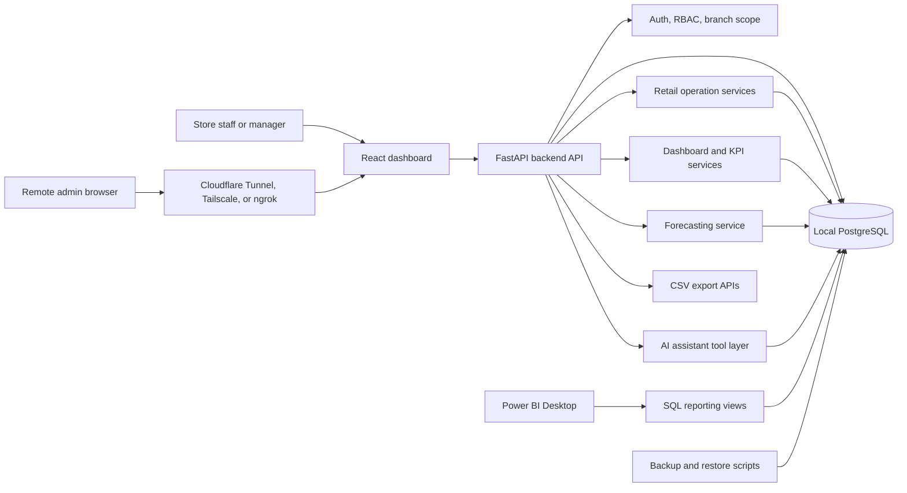
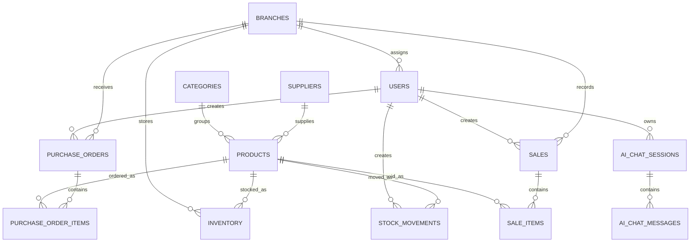
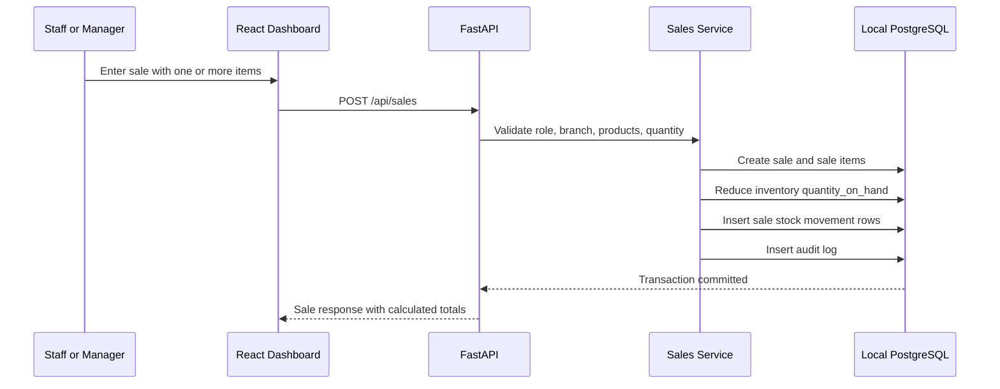
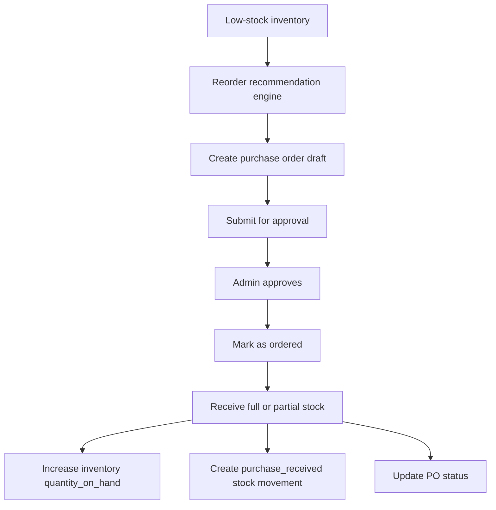
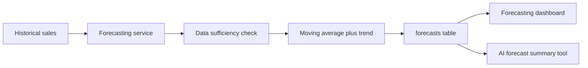
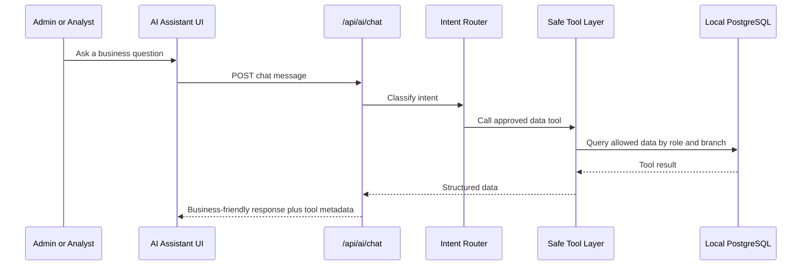
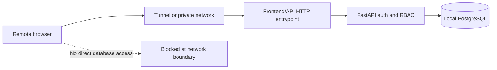

# Architecture

## Purpose

This document explains the architecture of the AI-Powered Hybrid Retail Inventory, Sales Analytics, and Remote Order Management System.

The currently implemented MVP is a local-first retail operations platform: the main PostgreSQL database stays local, while admins can access the authenticated web dashboard remotely through a tunnel or private network.

The approved, not-yet-implemented multi-venture architecture adds a Vercel cloud gateway, Supabase coordination database, Local Business Hub, durable synchronization, and automatic power/internet recovery. See [Hybrid Cloud Continuity PRD](../PRD_HYBRID_CLOUD_CONTINUITY_ADDENDUM.md), [Hybrid Cloud Continuity TRD](../TRD_HYBRID_CLOUD_CONTINUITY.md), and [Hybrid Continuity Phases](HYBRID_CLOUD_CONTINUITY_IMPLEMENTATION_PHASES.md). Those newer documents control the planned deployment topology.

## Architecture Principles

- Keep the operational database local by default.
- Expose the web dashboard and backend API, not the database.
- Route all data access through backend services.
- Enforce roles and branch scope in the backend.
- Calculate business metrics from real database records.
- Use stock movements as the audit trail for every inventory change.
- Use AI only through safe backend data tools for numerical answers.
- Keep reporting separate from operational workflows.

## System Context



## Component Map

| Component | Location | Responsibility |
| --- | --- | --- |
| React dashboard | `frontend/` | Authenticated operational UI, dashboards, forms, charts, AI chat, Power BI links. |
| FastAPI app | `backend/app/main.py` | API composition, CORS, route registration, error handling. |
| API routes | `backend/app/api/routes/` | HTTP endpoints for auth, master data, inventory, sales, dashboards, purchase orders, forecasts, exports, AI. |
| Service layer | `backend/app/services/` | Business rules, calculations, transactions, reporting exports, AI tool orchestration. |
| Models | `backend/app/models/` | SQLAlchemy entities and relationships. |
| Schemas | `backend/app/schemas/` | Request and response validation. |
| Migrations | `backend/alembic/` | Database schema and SQL reporting view migrations. |
| Seed data | `backend/scripts/seed.py` | Deterministic retail demo data for dashboards, forecasts, AI, and Power BI. |
| Tests | `backend/tests/` | Backend functional and workflow regression tests. |
| Backup scripts | `scripts/` | Local PostgreSQL backup and restore helpers. |
| Documentation | `docs/` | Setup, architecture, case study, demo, QA, Power BI, remote access, backup. |

## Backend Route Surface

All routes are mounted under `/api`.

```text
/health
/auth
/categories
/suppliers
/branches
/products
/inventory
/sales
/dashboard
/purchase-orders
/forecasts
/exports
/ai
```

## Data Model Overview



Core tables:

- `users`
- `branches`
- `categories`
- `suppliers`
- `products`
- `inventory`
- `stock_movements`
- `sales`
- `sale_items`
- `purchase_orders`
- `purchase_order_items`
- `forecasts`
- `ai_chat_sessions`
- `ai_chat_messages`
- `audit_logs`

## Business Flow: Sale Updates Stock



Rules:

- Backend calculates totals.
- Sale creation is transactional.
- Insufficient stock is rejected.
- Inventory is never changed silently.

## Business Flow: Reorder To Receiving



Rules:

- Draft purchase orders do not increase available stock.
- Marking ordered increases `quantity_on_order`.
- Receiving increases `quantity_on_hand` and reduces `quantity_on_order`.
- Invalid status transitions are rejected.
- Only authorized users can approve orders.

## Forecasting Flow



The MVP forecast is intentionally explainable. It supports 7, 30, and 90 day horizons and returns a clear insufficient-data message when historical sales are not enough.

## AI Assistant Flow



Safe tools:

- `get_sales_summary`
- `get_low_stock_items`
- `get_top_products`
- `get_slow_moving_products`
- `get_pending_purchase_orders`
- `get_reorder_recommendations`
- `get_forecast_summary`

Guardrails:

- Numerical answers come from backend tools.
- Missing data is explained.
- Delete requests are refused.
- Write-like requests require confirmation and do not mutate records through chat.
- Role and branch scope are enforced before tool data is returned.

## Reporting And Power BI

Power BI is a reporting layer, not an operational layer.

Reporting paths:

1. Power BI Desktop imports local SQL reporting views.
2. Power BI Desktop imports CSV files downloaded from authenticated export APIs.

Operational actions such as stock adjustment, sales entry, purchase order approval, and receiving remain in the web dashboard and API.

## Remote Access Boundary



Rules:

- PostgreSQL port `5432` must not be exposed publicly.
- Remote access must require app login.
- CORS and frontend API URL should match the chosen remote URL.
- Secrets and tunnel tokens must stay out of git.

## Security And Access Control

| Role | Access Pattern |
| --- | --- |
| Admin | Full access to all branches and operational workflows. |
| Store Manager | Assigned branch operations and reporting. |
| Staff | Limited sales entry and operational access. |
| Analyst | Reporting and dashboards, read-only for operations. |

Security controls:

- Password hashing.
- Signed bearer tokens.
- Logout invalidation in the running backend process.
- Backend dependencies for auth, role checks, and branch scope.
- Structured error responses.
- Audit logs for important actions.

## Reliability

The system supports local reliability through:

- Alembic migrations.
- Deterministic seed data.
- Backend tests for business rules.
- Workflow regression tests.
- Manual QA checklist.
- PostgreSQL backup and restore documentation.
- PowerShell backup and restore helper scripts.

## Known Architecture Tradeoffs

- The MVP uses local PostgreSQL rather than a managed cloud database to preserve the cost-optimized hybrid design.
- The AI assistant can optionally use OpenAI for response formatting, but deterministic backend tool responses remain the baseline.
- Frontend unit and browser end-to-end tests are not configured yet.
- Production deployment would benefit from a reverse proxy serving the frontend build and proxying `/api` to FastAPI.

## Related Docs

- [Setup Guide](SETUP_GUIDE.md)
- [Case Study](CASE_STUDY.md)
- [Demo Script](DEMO_SCRIPT.md)
- [Power BI Setup](POWER_BI_SETUP.md)
- [Remote Access](REMOTE_ACCESS.md)
- [Backup And Restore](BACKUP_RESTORE.md)
- [QA Checklist](QA_CHECKLIST.md)
- [Screenshots Guide](SCREENSHOTS.md)
- [Final Verification](FINAL_VERIFICATION.md)
