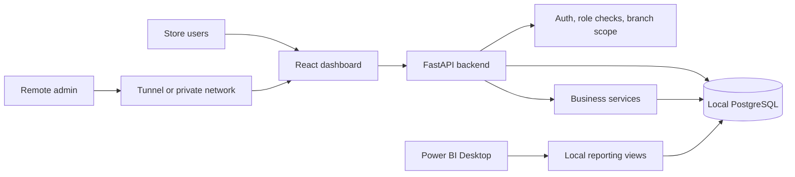

# Business Case Study

## Project

AI-Powered Hybrid Retail Inventory, Sales Analytics, and Remote Order Management System

## Executive Summary

A small retail business needs remote visibility into sales, stock, suppliers, and purchase orders, but does not want the cost of a fully cloud-hosted database. This project delivers a hybrid local-first system: the operational database stays local, while a secure web dashboard gives admins remote access to KPIs, inventory, reorder recommendations, purchase orders, forecasts, AI business answers, exports, and Power BI reporting support.

## Client Problem

The imagined client is a small multi-branch retail business that sells grocery, beverages, dairy, snacks, personal care, household, and stationery items.

The owner cannot always be physically present at each branch. They need to know:

- What sold today?
- Which products are low in stock?
- Which products should be reordered?
- Which branch is performing best?
- Which products are slow-moving?
- Which purchase orders are pending or ordered?
- What demand may look like next week or next month?

The owner also wants these answers without paying for a fully hosted cloud ERP or cloud database.

## Existing Pain Points

- Stock checks are manual and slow.
- Low-stock products are missed until customers ask for them.
- Sales summaries require spreadsheet cleanup.
- Staff sales entries do not always connect to inventory.
- Purchase orders are created late or without demand context.
- Supplier lead times are not considered consistently.
- Remote admins cannot safely check local store data.
- Power BI reporting is difficult when data is scattered.
- Cloud systems may be too expensive for the client size.

## Proposed Solution

Build a local-first full-stack retail management platform.

Core idea:

- Store the business database locally in PostgreSQL.
- Run a backend API that controls all database access.
- Run a React dashboard for remote and local users.
- Expose only the app/API through a secure tunnel or private network.
- Keep PostgreSQL private.
- Use backend services to calculate KPIs, stock movements, reorder recommendations, forecasts, and AI tool results.

The result is a lower-cost operational system that still feels modern, remote-ready, and BI-friendly.

## Architecture



Architecture highlights:

- The browser never connects directly to PostgreSQL.
- Backend APIs enforce permissions.
- Inventory changes are recorded through stock movements.
- Power BI is a reporting layer, not an operational control layer.
- Remote access can use Cloudflare Tunnel, Tailscale, or ngrok.

Read the full architecture in [ARCHITECTURE.md](ARCHITECTURE.md).

## Key Features

### Authentication And Roles

- Admin can access all branches and features.
- Store Manager can operate within assigned branch scope.
- Staff can record sales and limited operations.
- Analyst can view dashboards and reports but cannot modify operational data.

### Master Data

- Products, categories, suppliers, and branches.
- Product SKU uniqueness.
- Supplier lead times and contact data.
- Product cost, selling price, reorder threshold, and target stock level.

### Inventory

- Inventory tracked per product and branch.
- Low-stock detection using quantity on hand and reorder threshold.
- Manual stock adjustments with required reason.
- Stock movement ledger for every stock change.

### Sales

- Staff and managers can record sales.
- Sales support multiple sale items.
- Backend calculates subtotal, discount, tax, total, units, and gross profit.
- Sales reduce inventory atomically.

### Dashboards

- Overview dashboard.
- Sales Summary dashboard.
- Inventory dashboard.
- Purchase Orders dashboard.
- Filters for date, branch, category, product, and supplier where relevant.

### Reorder Recommendations

Formula:

```text
Suggested quantity = target stock level - current quantity on hand + expected demand during supplier lead time
```

Expected demand:

```text
Average daily sales * supplier lead time
```

Priority logic:

- Critical: stock is zero or expected to run out before supplier lead time.
- High: stock is below reorder threshold.
- Medium: stock is near reorder threshold.
- Low: stock is healthy.

### Purchase Orders

Status lifecycle:

```text
Draft -> Pending Approval -> Approved -> Ordered -> Partially Received -> Received
```

Business rules:

- Creating a purchase order does not increase stock.
- Marking an order as ordered increases quantity on order.
- Receiving an order increases quantity on hand.
- Receiving creates `purchase_received` stock movements.
- Invalid transitions are rejected.

### Forecasting

Forecasting uses historical sales and an explainable moving average plus trend approach.

Supported horizons:

- 7 days
- 30 days
- 90 days

The service returns historical points, forecast points, trend label, and insufficient-data messaging.

### AI Assistant

The assistant answers business questions using backend tools.

Example questions:

- What are today's sales?
- Which products are low in stock?
- Which items should I reorder today?
- What are the top-selling products this month?
- Which branch performed best?
- Which products are slow-moving?
- Summarize pending purchase orders.
- Forecast next week's demand.

Guardrails:

- No invented business numbers.
- Numerical answers use backend tool results.
- Missing data is explained.
- Write-like requests require confirmation.
- Role and branch permissions are respected.

### Power BI Reporting

Power BI can connect to local SQL reporting views or import CSV exports.

Recommended report pages:

- Executive Overview
- Sales Performance
- Inventory Health
- Supplier and Purchase Orders
- Forecast and Recommendations

## Business KPIs Tracked

| KPI | Definition |
| --- | --- |
| Revenue | Sum of sale item line totals after discounts. |
| Gross Profit | Revenue minus cost of goods sold. |
| Gross Margin Percent | Gross profit divided by revenue. |
| Units Sold | Sum of sold item quantities. |
| Transactions | Count of sales. |
| Average Order Value | Revenue divided by transaction count. |
| Current Stock Value | Quantity on hand multiplied by unit cost. |
| Low-Stock Count | Products where stock is at or below threshold. |
| Pending Purchase Orders | Open orders needing action or receipt. |
| Sales Growth Percent | Current period revenue compared to previous period. |
| Slow-Moving Stock | Stock on hand with no recent sales in the selected period. |

## Expected Business Impact

- Faster remote stock visibility for owners.
- Reduced stockout risk through low-stock alerts and reorder recommendations.
- Better purchase planning by considering sales velocity and supplier lead time.
- Faster sales reporting for weekly or monthly review.
- Clear branch and category performance comparisons.
- Better inventory cash control by surfacing slow-moving products.
- Lower infrastructure cost by keeping the main database local.
- Stronger reporting through Power BI views and CSV exports.
- Safer operations through role-based access and audit logs.

## Consulting-Style Delivery

This project demonstrates:

- SQL data modeling and reporting views.
- Full-stack product delivery.
- Business dashboard design.
- Transactional inventory logic.
- Forecasting and analytics.
- AI assistant guardrails.
- Cost-aware hybrid architecture.
- Documentation and QA discipline.

## Portfolio Talking Points

- "The database is local to reduce cost, but the dashboard can be accessed remotely."
- "The AI assistant does not guess numbers. It routes questions through backend data tools."
- "Inventory changes are auditable because every sale, receipt, and adjustment creates a movement record."
- "Purchase orders affect available stock only when goods are received."
- "Power BI is used for executive reporting, while operational workflows remain in the app."

## Related Docs

- [Architecture](ARCHITECTURE.md)
- [Demo Script](DEMO_SCRIPT.md)
- [Setup Guide](SETUP_GUIDE.md)
- [Power BI Setup](POWER_BI_SETUP.md)
- [Remote Access](REMOTE_ACCESS.md)
- [Backup And Restore](BACKUP_RESTORE.md)
- [QA Checklist](QA_CHECKLIST.md)
- [Screenshots Guide](SCREENSHOTS.md)
