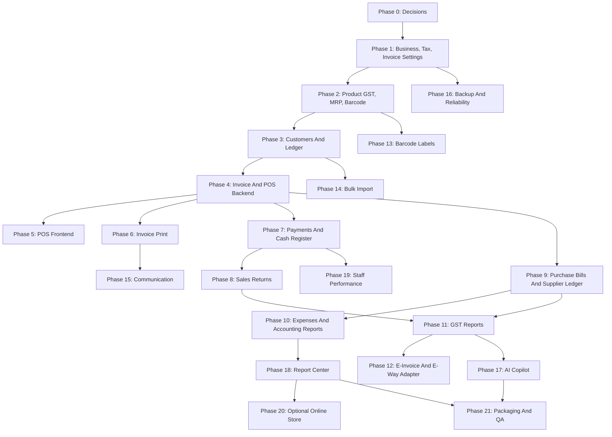

# Hitech-Competitive Expansion Plan

## Purpose

This document breaks the Hitech-competitive add-on PRD into an executable build plan for the existing local-first retail system.

It should be used together with:

- [Add-On PRD](../PRD_HITECH_COMPETITIVE_ADDONS.md)
- [Add-On Agent Prompts](../AGENT_STEP_BY_STEP_PROMPTS_HITECH_ADDONS.md)
- [Add-On Architecture Decisions](ADDON_ARCHITECTURE_DECISIONS.md)

## Expansion Goal

Upgrade the current verified MVP into a more complete Indian retail billing and management platform with:

- fast POS billing
- GST and Non-GST invoices
- HSN/SAC, GST rates, MRP, units, and barcode catalog fields
- invoice print/PDF/receipt templates
- customer ledger and credit sales
- payment collection and cash register
- purchase bills and supplier ledger
- sale returns, refunds, credit notes, purchase returns, and debit notes
- GST reports and CA-friendly exports
- e-invoice/e-way bill adapter-ready workflow
- barcode label generation
- bulk import/export
- invoice sharing
- automated backup visibility
- advanced AI business copilot
- expanded report center and Power BI datasets

The expansion must preserve the existing local-first architecture and completed MVP workflows.

## Strategic Build Order



## Phase 0: Competitive Baseline And Compliance Planning

Goal:

Create the planning foundation before feature work.

Deliverables:

- `docs/ADDON_ARCHITECTURE_DECISIONS.md`
- `docs/HITECH_COMPETITIVE_EXPANSION_PLAN.md`

Dependencies:

- Original MVP complete.

Testing gate:

- Backend tests available and passing, or known limitations documented.
- Frontend typecheck/build available and passing, or known limitations documented.

Exit criteria:

- Invoice/sales relationship decision documented.
- GST assumptions documented.
- Transaction rules documented.
- Compliance disclaimer documented.
- Phase order documented.

## Phase 1: Business Profile, Tax, And Invoice Settings

Goal:

Add the configuration required before any GST or invoice transaction can exist.

Backend additions:

- companies
- business profiles
- GST registrations
- tax rates
- invoice sequences
- payment modes
- print templates
- fiscal periods

Frontend additions:

- Business Profile settings
- GST/Tax settings
- Payment Modes settings
- Invoice Sequences settings
- Print Template placeholder

Seed additions:

- demo company
- GST/state data
- GST rates 0, 5, 12, 18, 28
- Cash, UPI, Card, Bank Transfer, Credit payment modes
- default invoice sequence

Testing gate:

- settings CRUD tests
- Admin-only write permission tests
- invoice number generation tests
- existing auth, inventory, and sales regression tests
- frontend typecheck/build

Exit criteria:

- Admin can configure business and tax settings.
- Non-admin writes are blocked.
- Invoice number generation is safe.

## Phase 2: Product Catalog Upgrade For Indian Retail

Goal:

Upgrade products for Indian billing and POS workflows.

Product additions:

- HSN/SAC
- GST rate reference
- cess percent
- primary barcode
- alternate barcodes
- unit of measure
- MRP
- brand
- manufacturer
- item type
- batch tracking flag
- serial tracking flag
- expiry tracking flag

New entities:

- product_barcodes
- product_units
- product_price_history
- inventory_batches
- serial_numbers

Frontend additions:

- expanded product form
- barcode/SKU/name search
- HSN/GST/MRP fields in product table

Testing gate:

- product create/update/search tests
- barcode uniqueness tests
- master data regression tests
- inventory/sales regression tests
- frontend typecheck/build

Exit criteria:

- Products can be searched by barcode.
- Duplicate barcodes are rejected.
- Products contain GST and retail fields.

## Phase 3: Customer Management And Customer Ledger

Goal:

Add customer records, credit limits, outstanding balance, payments, and ledger history.

New entities:

- customers
- customer_addresses
- customer_ledger_entries
- customer_payments

Frontend additions:

- Customers page
- customer create/edit form
- customer detail/ledger view
- payment receipt form
- outstanding list

Testing gate:

- customer CRUD tests
- ledger balance tests
- payment tests
- credit limit helper tests
- auth/permission regression tests
- frontend typecheck/build

Exit criteria:

- Customer outstanding is calculated from ledger entries.
- Customer payments reduce outstanding balance.
- Future invoice flow can validate credit limits.

## Phase 4: Invoice And POS Billing Backend

Goal:

Build the transactional invoice and POS checkout backend.

New entities:

- invoices
- invoice_items
- invoice_taxes
- invoice_payments
- invoice_status_history

APIs:

- `GET /invoices`
- `POST /invoices`
- `GET /invoices/{id}`
- `POST /invoices/{id}/issue`
- `POST /invoices/{id}/cancel`
- `POST /invoices/{id}/payments`
- `GET /pos/products/search`
- `POST /pos/checkout`

Critical rules:

- Backend calculates all totals.
- Issued invoice reduces stock.
- Draft invoice does not reduce stock.
- Tax rows are stored.
- Stock movement is created for each stock reduction.
- Credit/partial invoice creates customer receivable.
- Existing sales dashboards remain compatible.

Testing gate:

- invoice tax tests
- POS checkout tests
- stock reduction tests
- stock movement tests
- customer receivable tests
- insufficient stock tests
- permission tests
- sales/dashboard regression tests

Exit criteria:

- API can issue GST invoice with payment and stock movement.
- API can issue credit invoice and create ledger entry.
- Current sales analytics still work.

## Phase 5: Fast POS Frontend

Goal:

Build the counter-friendly billing interface.

Frontend additions:

- POS Billing route
- barcode input focused by default
- product search by barcode, SKU, name
- cart
- customer selector
- GST/Non-GST selector
- payment mode selector
- split payment UI if backend supports it
- checkout success panel

Testing gate:

- frontend typecheck/build
- backend invoice/POS tests
- manual browser test for checkout
- role access test for Staff/Admin/Analyst

Exit criteria:

- Staff can create a POS invoice from the UI.
- Inventory reduces after checkout.
- Analyst cannot access POS.

## Phase 6: Invoice Print, PDF, And Receipt Templates

Goal:

Support printable invoices and receipts.

Templates:

- A4 GST invoice
- A5 invoice
- 58mm POS receipt
- 80mm POS receipt
- Non-GST invoice
- credit note later
- purchase bill later

Testing gate:

- invoice print data tests
- template selection tests
- frontend typecheck/build
- manual browser print preview

Exit criteria:

- Issued invoice can be previewed and printed.
- GST breakup appears correctly.
- POS receipt is readable.

## Phase 7: Payments, Credit, And Cash Register

Goal:

Track real payment flows and daily register sessions.

New entities:

- cash_register_sessions
- payment_transactions
- payment_reconciliations
- drawer_movements

Payment modes:

- cash
- UPI
- card
- bank transfer
- wallet
- cheque
- credit

Testing gate:

- payment tests
- split payment tests
- credit invoice tests
- cash register open/close tests
- customer ledger regression tests
- frontend typecheck/build

Exit criteria:

- Invoices can be fully paid, partially paid, or credit.
- Staff can open and close register.
- Admin can view payment summary by mode.

## Phase 8: Sales Returns, Refunds, And Credit Notes

Goal:

Handle returned goods, tax reversal, refunds, and customer credit notes.

New entities:

- sales_returns
- sales_return_items
- credit_notes
- credit_note_items if needed
- refund_transactions if separate from payments

Testing gate:

- return quantity validation tests
- stock increase tests
- tax reversal tests
- ledger adjustment tests
- refund tests
- dashboard regression tests
- frontend typecheck/build

Exit criteria:

- Return quantity cannot exceed sold quantity.
- Saleable return increases inventory.
- Credit note is created.
- Customer ledger is adjusted.

## Phase 9: Purchase Bills, Purchase Returns, And Supplier Ledger

Goal:

Add supplier bill and payable workflows.

New entities:

- purchase_bills
- purchase_bill_items
- purchase_bill_taxes
- supplier_ledger_entries
- supplier_payments
- purchase_returns
- purchase_return_items
- debit_notes

Testing gate:

- purchase bill tests
- PO-to-bill tests
- supplier payable tests
- supplier payment tests
- purchase return tests
- inventory and PO regression tests
- frontend typecheck/build

Exit criteria:

- Purchase bill receiving increases stock.
- Supplier ledger shows bills, payments, returns, and adjustments.
- Existing PO workflow still works.

## Phase 10: Expense Tracking And Basic Accounting Reports

Goal:

Add accounting-lite visibility without becoming a full accounting system.

New entities:

- expense_categories
- expenses
- account_heads if needed
- ledger_entries if a unified simple ledger is practical

Reports:

- daily profit summary
- expense summary
- payment mode summary
- receivables
- payables
- gross profit by item
- cashbook

Testing gate:

- expense CRUD tests
- report total tests
- payment and ledger regression tests
- frontend typecheck/build

Exit criteria:

- Expenses can be recorded.
- Daily profit and cashbook reports use real records.

## Phase 11: GST Reporting And CA Exports

Goal:

Generate GST reports from stored transaction tax rows.

Reports:

- sales register
- purchase register
- HSN summary
- tax liability summary
- GSTR-1 style outward supplies
- GSTR-3B style summary
- validation report

Testing gate:

- GST report total tests
- export tests
- validation warning tests
- invoice, purchase bill, return regression tests
- frontend typecheck/build

Exit criteria:

- GST reports can be filtered by tax period.
- CSV exports work.
- Missing/invalid data is flagged.

## Phase 12: E-Invoice And E-Way Bill Adapter-Ready Workflow

Goal:

Prepare compliance payloads without live provider dependency.

New entities:

- einvoice_requests
- eway_bill_requests
- compliance_payloads

Testing gate:

- payload generation tests
- validation tests
- manual result storage tests
- GST/invoice regression tests
- frontend typecheck/build

Exit criteria:

- Eligible invoice can generate structured payload.
- Admin can manually record IRN/e-way details.
- No provider secrets are committed.

## Phase 13: Barcode Label Generation

Goal:

Generate and print product barcode labels.

Testing gate:

- barcode uniqueness tests
- label data tests
- POS barcode search regression tests
- frontend typecheck/build

Exit criteria:

- Admin can generate barcode.
- Label preview is printable.
- POS can find the barcode.

## Phase 14: Bulk Import And Data Migration Tools

Goal:

Support onboarding through CSV templates, validation, imports, and exports.

Imports:

- products
- customers
- suppliers
- opening stock
- prices
- barcodes

Testing gate:

- CSV validation tests
- duplicate handling tests
- opening stock movement tests
- export tests
- frontend typecheck/build

Exit criteria:

- CSV errors are row-specific.
- Opening stock import creates stock movement.
- Exports have clear headers.

## Phase 15: Communication And Invoice Sharing

Goal:

Share invoices and create payment reminders through provider-safe workflows.

Channels:

- email
- WhatsApp link
- SMS provider abstraction

Testing gate:

- template rendering tests
- missing provider fallback tests
- message log tests
- invoice/customer regression tests
- frontend typecheck/build

Exit criteria:

- Invoice sharing creates message or share link.
- Payment reminder uses real ledger amount.
- Missing provider credentials do not crash the app.

## Phase 16: Automated Backup, Restore, And Local Reliability

Goal:

Improve the local-first safety story.

Deliverables:

- backup status API if safe
- backup status settings page
- Windows Task Scheduler documentation
- retention policy
- optional encryption guidance
- no hardcoded secrets

Testing gate:

- backup status tests if API is implemented
- frontend typecheck/build if UI changes
- manual script inspection

Exit criteria:

- Admin can see backup guidance/status.
- Backup/restore docs are current.
- Database remains local.

## Phase 17: Advanced AI Business Copilot

Goal:

Expand AI into invoices, GST, ledgers, cash, payments, and reporting.

Tools:

- get_gst_summary
- get_customer_outstanding
- get_supplier_payables
- get_cash_register_summary
- get_invoice_profitability
- draft_invoice
- draft_purchase_bill
- draft_payment_reminder
- explain_tax_report
- detect_stock_anomalies
- suggest_discount_strategy

Testing gate:

- AI add-on tool tests
- no-invented-numbers tests
- confirmation-required tests
- role/branch scope tests
- related service regression tests
- frontend typecheck/build

Exit criteria:

- AI answers expanded questions from backend tools.
- AI drafts but does not auto-execute writes.
- Branch scope is respected.

## Phase 18: Competitive Reporting Library

Goal:

Create a broad app report center and update Power BI datasets.

Report categories:

- sales
- invoices
- inventory
- purchases
- customer receivable
- supplier payable
- GST/tax
- profit
- staff
- payment
- cash register
- reorder
- forecast

Testing gate:

- report catalog tests
- filter tests
- export tests
- dashboard and GST regression tests
- frontend typecheck/build

Exit criteria:

- At least 30 useful reports exist.
- Reports filter and export correctly.
- Power BI views are updated.

## Phase 19: Staff Performance, Commission, And Access Rights

Goal:

Add staff performance and simple commission reporting.

Testing gate:

- staff performance tests
- commission calculation tests
- permission tests
- invoice/payment regression tests
- frontend typecheck/build

Exit criteria:

- Admin can view sales by staff.
- Manager can view assigned branch staff.
- Commission report uses real invoice/sales data.

## Phase 20: Optional Online Store And Customer Ordering Portal

Goal:

Add optional customer order requests after core billing is stable.

Important:

This phase should wait until POS, GST, payments, ledgers, reports, AI, and backup foundations are stable.

Testing gate:

- order request tests
- approval/rejection tests
- invoice conversion tests
- stock validation tests
- frontend typecheck/build

Exit criteria:

- Customer can submit order request.
- Admin can approve and convert to invoice.
- Invoice still uses stock, tax, and ledger rules.

## Phase 21: Packaging, Demo, QA, And Portfolio Upgrade

Goal:

Make the upgraded product understandable and impressive for GitHub, interviews, and consulting presentation.

Deliverables:

- README update
- add-on architecture doc
- Hitech-competitive case study
- Hitech-competitive demo script
- Hitech-competitive QA checklist
- updated Power BI docs
- updated remote access docs if needed
- updated backup docs
- final verification report
- screenshot placeholders or screenshots

Testing gate:

- backend full or critical test suite
- frontend typecheck/build
- manual full demo
- final verification document

Exit criteria:

- Reviewer can understand the upgraded product without extra explanation.
- Demo flow matches implementation.
- Critical tests pass or known gaps are documented.

## Dependency Summary

| Phase | Depends On | Why |
| --- | --- | --- |
| 1 | Phase 0 | Settings need decisions first. |
| 2 | Phase 1 | Products need tax rates and retail config. |
| 3 | Phase 1 | Customer ledger needs branch/company/payment assumptions. |
| 4 | Phases 1, 2, 3 | Invoices need settings, product tax/barcode fields, customers. |
| 5 | Phase 4 | POS UI needs checkout API. |
| 6 | Phase 4 | Print needs issued invoices and tax rows. |
| 7 | Phases 3, 4 | Payments need invoices and customer ledger. |
| 8 | Phases 4, 7 | Returns need invoices, payments, ledgers. |
| 9 | Phases 1, 2, existing POs | Purchase bills need tax/product data and PO integration. |
| 10 | Phases 7, 9 | Accounting reports need payments and ledgers. |
| 11 | Phases 4, 8, 9 | GST reports need invoice, return, and purchase tax rows. |
| 12 | Phase 11 | Compliance payloads need clean GST data. |
| 13 | Phase 2 | Barcode labels need barcode catalog fields. |
| 14 | Phases 2, 3 | Imports need stable product/customer schemas. |
| 15 | Phases 3, 6, 7 | Sharing needs customers, invoices, payment reminders. |
| 16 | Existing backup docs | Can be improved independently after settings foundation. |
| 17 | Phases 7, 9, 11 | AI needs reliable invoice, ledger, payment, GST data. |
| 18 | Phases 10, 11 | Report center needs full transaction data. |
| 19 | Phases 4, 7 | Staff performance needs invoices and payments. |
| 20 | Core billing stable | Storefront must not bypass billing controls. |
| 21 | All implemented phases | Packaging verifies and documents actual behavior. |

## Minimum Competitive MVP Scope

If time is limited, build these first:

1. Phase 1: Business profile, tax, invoice settings.
2. Phase 2: Product HSN/GST/barcode/MRP fields.
3. Phase 3: Customers and customer ledger.
4. Phase 4: Invoice and POS backend.
5. Phase 5: POS frontend.
6. Phase 6: Invoice print/receipt.
7. Phase 7: Payments and credit.
8. Phase 8: Sales returns.
9. Phase 9: Purchase bills and supplier ledger.
10. Phase 11: GST reports.
11. Phase 17: Advanced AI tools.
12. Phase 21: Packaging and QA.

This set most directly matches traditional Indian billing software while preserving the project's AI and analytics advantage.

## Risk Register

| Risk | Impact | Mitigation |
| --- | --- | --- |
| Invoice and existing sales logic diverge | Dashboards become inconsistent | Use a compatibility bridge or invoice-based reporting views and regression tests. |
| GST calculations are wrong | High business risk | Store tax snapshots, add tests, include CA review disclaimer. |
| Stock changes happen without movements | Inventory becomes untrusted | Centralize stock mutation helpers and test every stock-changing workflow. |
| Ledger balances are overwritten incorrectly | Receivables/payables become untrusted | Use append-style ledger entries and computed balances. |
| POS UI becomes too slow | Counter billing unusable | Build a dedicated dense POS screen with focused barcode input. |
| Scope becomes too large | Project stalls | Use phases and do not start later modules until gates pass. |
| Live compliance integration is overclaimed | Legal/product risk | Use adapter-ready workflow and manual result recording for MVP. |
| Frontend hides roles but backend allows writes | Security bug | Enforce every permission in backend tests. |
| Seed data becomes unrealistic | Reports and demos look weak | Update seed data in each phase with meaningful scenarios. |

## Phase Report Template

Each phase should end with:

```text
Phase completed:

Files changed:
- ...

Features implemented:
- ...

Commands run:
- ...

Verification results:
- ...

Known gaps or follow-ups:
- ...

Next recommended phase:
- ...
```

## Final Demo Flow Target

1. Explain Indian retail billing, GST, inventory, and remote visibility problem.
2. Show local-first architecture.
3. Log in as Admin.
4. Configure business GST profile.
5. Show product with HSN, GST, barcode, MRP, and stock.
6. Log in as Staff.
7. Open POS billing.
8. Scan/search products.
9. Create GST invoice with cash/UPI payment.
10. Print/download invoice.
11. Show inventory reduced and stock movement created.
12. Create credit sale for a customer.
13. Show customer outstanding ledger.
14. Record customer payment.
15. Create sale return and credit note.
16. Show GST report for the month.
17. Create purchase bill or receive PO.
18. Show supplier payable ledger.
19. Ask AI: Which customers have overdue balances?
20. Ask AI: Summarize this month's GST sales.
21. Ask AI: Which items should I reorder today?
22. Show forecasting and reorder dashboard.
23. Show Power BI/report center.
24. Explain how the product beats traditional billing software through AI, analytics, Power BI, and remote local-first design.

## Phase 0 Conclusion

The expansion should proceed one phase at a time. The next implementation phase is:

Phase 1: Business Profile, Tax, And Invoice Settings Foundation.

Do not start POS, invoices, GST reports, or AI add-on tools until the settings, product catalog, and customer ledger foundations are in place.

