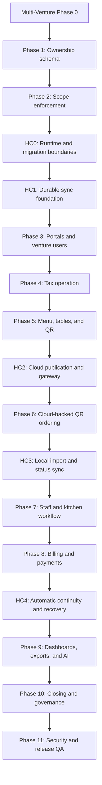

# Hybrid Cloud Continuity Implementation Phases

## Status And Purpose

- Version: 1.0
- Status: Required integration plan; implementation not started
- Last updated: 2026-08-11

This plan integrates Vercel, Supabase, the Local Business Hub, and automatic outage recovery into the approved multi-venture execution sequence. It must be used with:

- `PRD_HYBRID_CLOUD_CONTINUITY_ADDENDUM.md`;
- `TRD_HYBRID_CLOUD_CONTINUITY.md`;
- `PRD_MULTI_VENTURE_CAFE_EXPANSION.md`;
- `TRD_MULTI_VENTURE_CAFE_EXPANSION.md`;
- `docs/MULTI_VENTURE_CAFE_IMPLEMENTATION_PHASES.md`.

Do not treat these phases as a replacement for venture isolation, Cafe ordering, billing, reporting, or governance phases. They add the cloud and recovery foundation those features must use.

## Integrated Dependency Order

## HC0: Runtime, Configuration, And Migration Boundaries

### Goal

Prepare one repository for safe Local Hub and cloud gateway deployment without changing business behavior.

### Work

- Add deployment-mode configuration with fail-closed route registration.
- Add separate local runtime, cloud runtime, and cloud migration database settings.
- Preserve the current local Alembic history and create an independent cloud migration path.
- Add environment templates without secrets.
- Add Vercel build entry point for the limited cloud gateway.
- Add a local service/installation design for PostgreSQL, API, worker, frontend, and backups.
- Document public, server-only, device, and migration credentials.

### Required Tests

- Local mode registers all expected operational routes.
- Cloud mode does not register inventory adjustment, final billing, purge execution, or backup routes.
- Local and cloud migrations cannot target the wrong database accidentally.
- Existing Retail regression tests still pass.
- Frontend typecheck and build pass.

### Exit Gate

No Supabase write or synchronization implementation begins until deployment modes and migration separation fail closed.

## HC1: Durable Local Synchronization Foundation

### Goal

Create a crash-safe local outbox/inbox worker that can stop and resume without losing or duplicating business effects.

### Work

- Add local synchronization models and migration.
- Add versioned event-envelope schemas.
- Add transactional outbox helper used within domain transactions.
- Add inbox receipt and idempotent consumer framework.
- Add aggregate-version checks and dead-letter handling.
- Add persisted checkpoints, bounded batch processing, exponential retry, jitter, and graceful shutdown.
- Add device identity and credential storage abstraction without committing credentials.
- Run the worker under an automatic restart policy in development and documented production setup.

### Required Tests

- Outbox record commits with its domain change.
- Domain rollback also rolls back its outbox record.
- Duplicate delivery creates one business effect.
- Lost acknowledgment causes safe redelivery.
- Process termination and restart resume from the last checkpoint.
- Future aggregate versions wait or fail visibly rather than applying out of order.
- Dead-letter retry is audited.

### Exit Gate

No QR order is accepted through Supabase until the local consumer proves idempotent crash recovery.

## HC2: Supabase Coordination Schema And Vercel Cloud Gateway

### Goal

Deploy the minimal cloud coordination boundary and publish safe Cafe read models.

### Work

- Create the private Supabase coordination schema and migrations.
- Add device registration, heartbeat, writer lease, receipts, commands, menu publication, QR hash, cloud order, snapshot, and tombstone tables as required by the TRD.
- Configure grants and RLS for every exposed relation.
- Add the limited FastAPI cloud gateway with health/readiness endpoints.
- Configure Supabase transaction-pooler runtime access and separate migration access.
- Add Vercel frontend routing for cloud-safe APIs and selected tunneled operational APIs.
- Publish versioned Cafe menu, table, QR hash, and availability snapshots from the Local Hub.
- Display snapshot freshness where used.

### Required Tests

- React contains no Supabase secret/service-role credential.
- Cloud route discovery contains no local-only operational write route.
- Cafe Partner and public clients cannot discover Retail rows or counts.
- A revoked device or QR fails closed.
- Replaying a menu publication is idempotent.
- A partial publication does not become the active menu version.
- Vercel build and cloud migration rehearsal pass.

### Exit Gate

Public QR ordering may start only after cloud isolation, secrets, route exposure, and publication tests pass.

## HC3: Cloud Order Intake And Local Convergence

### Goal

Connect cloud customer orders to the existing Cafe order engine and send committed local status back to the cloud.

### Work

- Persist customer order and item snapshots in Supabase with idempotency keys.
- Return a durable public order reference only after cloud commit.
- Mark new cloud orders `awaiting_cafe_confirmation`.
- Pull cloud orders through the Local Hub worker.
- Import each cloud order into the same service used by authenticated staff orders.
- Record cloud/local identity links and inbox receipts atomically.
- Push accepted, preparing, ready, served, billed, rejected, and closed states after local commit.
- Prevent stale cloud snapshots from promising stock availability.
- Add last heartbeat, last sync, queue depth, and oldest pending age to scoped admin views.

### Required Tests

- Duplicate customer taps return one order reference.
- Duplicate worker delivery creates one local order.
- QR and staff orders converge into one table session and queue.
- A locally rejected order returns a safe cloud status.
- Local outage leaves the cloud order durable.
- Local restart imports the pending order automatically.
- Cross-venture IDs, modified prices, and stale QR tokens fail closed.

### Exit Gate

Staff and kitchen phases may rely on cloud orders only after local/cloud identity and status convergence is proven.

## HC4: Automatic Continuity, Reconciliation, And Recovery

### Goal

Prove uninterrupted queued operation and automatic restart after internet, process, operating-system, or power interruption.

### Work

- Add signed Local Hub heartbeat and health state.
- Add writer lease and monotonically increasing fencing epoch.
- Add continuity state and safe emergency transaction references.
- Keep public order intake active automatically during Local Hub outage.
- Add local startup orchestration and dependency health checks.
- Automatically pull, process, acknowledge, push, reconcile, and update snapshots after recovery.
- Keep retryable failures queued and route permanent failures to visible attention.
- Add UI states for live, local-only, cloud continuity, recovering, stale, and attention required.
- Add reconciliation report for orders, invoices, payments, stock effects, queue receipts, and closing.
- Update backup and restore to include queue, checkpoint, device, and reconciliation state.

### Required Failure-Injection Tests

- Internet loss before and after local commit.
- Power/process loss before and after inbox commit.
- Lost cloud acknowledgment.
- Duplicate and out-of-order delivery.
- Stale writer lease and fencing epoch.
- Local database temporarily unavailable at startup.
- Supabase temporarily unavailable during queue drain.
- Local restart with pending inbound and outbound work.
- Automatic queue drain with zero duplicate invoice or stock movement.
- Dead-letter visibility and audited retry.
- Backup/restore with pending queue entries.

### Exit Gate

The product must not be called continuity-ready until the restart and outage evidence proves no acknowledged work is lost and no financial or stock effect is duplicated.

## Phase Report Addition

Every affected phase report must include:

- deployment mode tested;
- local and cloud migration revisions;
- queue counts before and after the test;
- last checkpoint and synchronization freshness;
- failure injection performed;
- duplicate-effect verification;
- security/RLS checks;
- unresolved dead-letter or reconciliation records;
- whether the next dependency gate is open.

