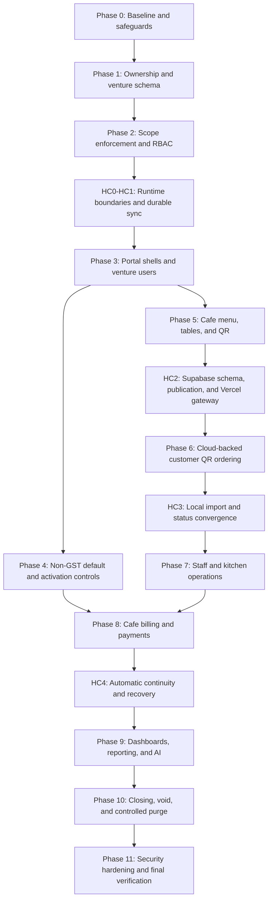

# Multi-Venture Retail And Cafe Implementation Phases

## Status And Purpose

- Version: 1.0
- Status: Execution plan; implementation not started
- Last updated: 2026-08-11

This plan turns the approved multi-venture and Cafe design into small, testable vertical phases. It must be used with:

- `PRD.md`
- `PRD_HITECH_COMPETITIVE_ADDONS.md`
- `PRD_MULTI_VENTURE_CAFE_EXPANSION.md`
- `PRD_HYBRID_CLOUD_CONTINUITY_ADDENDUM.md`
- `TRD_MULTI_VENTURE_CAFE_EXPANSION.md`
- `TRD_HYBRID_CLOUD_CONTINUITY.md`
- `docs/HYBRID_CLOUD_CONTINUITY_IMPLEMENTATION_PHASES.md`
- `AGENT_STEP_BY_STEP_PROMPTS_MULTI_VENTURE_CAFE.md`
- `EXECUTION_FLOW_ANALYSIS.md`
- `AGENT_STEP_BY_STEP_PROMPTS.md`
- `AGENT_STEP_BY_STEP_PROMPTS_HITECH_ADDONS.md`

The product PRDs define what the expansion must do. The TRDs define how business security and hybrid continuity must be integrated. This document and the hybrid continuity phase plan together define the required build order.

## Execution Rules

1. Implement one phase at a time.
2. Do not begin Cafe customer features until existing Retail APIs are company-scoped and cross-venture isolation tests pass.
3. Do not replace the existing invoice, payment, inventory, ledger, audit, or authentication systems.
4. Do not trust frontend role hiding or client-supplied company/price/tax data.
5. Run targeted tests and existing regression tests after every phase.
6. Fix all critical and security failures before starting the next phase.
7. Use Alembic for schema changes and preserve existing IDs and totals.
8. Keep local PostgreSQL as the operational system of record, use Supabase only for approved coordination/read models, and never expose either database directly to browsers.
9. Update seed data and documentation in the same phase as behavior changes.
10. Do not implement deferred systems such as Redis, WebSockets, recipe inventory, online payments, or dynamic role builders in the MVP; use the approved PostgreSQL-backed durable queue.
11. Follow `docs/HYBRID_CLOUD_CONTINUITY_IMPLEMENTATION_PHASES.md` at the dependency points shown there.
12. Do not acknowledge synchronized work before database commit, and do not keep required queue/checkpoint state only in memory.

## Standard Agent Preamble

Use this instruction at the start of every future phase request:

```text
You are extending the existing AI-Powered Hybrid Retail Billing and POS project into a secure multi-venture Retail and Cafe platform.

Before changing code, read:
- PRD.md
- PRD_HITECH_COMPETITIVE_ADDONS.md
- PRD_MULTI_VENTURE_CAFE_EXPANSION.md
- PRD_HYBRID_CLOUD_CONTINUITY_ADDENDUM.md
- TRD_MULTI_VENTURE_CAFE_EXPANSION.md
- TRD_HYBRID_CLOUD_CONTINUITY.md
- docs/MULTI_VENTURE_CAFE_IMPLEMENTATION_PHASES.md
- docs/HYBRID_CLOUD_CONTINUITY_IMPLEMENTATION_PHASES.md
- AGENT_STEP_BY_STEP_PROMPTS_MULTI_VENTURE_CAFE.md
- the current code and migrations

Treat the PRDs as product contracts and both TRDs as technical/security contracts.
Use the matching standalone phase prompt in AGENT_STEP_BY_STEP_PROMPTS_MULTI_VENTURE_CAFE.md and implement only that phase.
Preserve existing Retail behavior and unrelated worktree changes.
Backend venture and branch authorization is mandatory.
Local PostgreSQL is authoritative for financial and stock effects. Supabase is the approved durable coordination and cloud read-model database.
All synchronization must resume from durable checkpoints and remain idempotent across retries, process restarts, and power recovery.
At completion, report changed files, requirements completed, commands run, results, known gaps, and the next phase.
```

## Phase Dependency Map



The HC gates are defined in `docs/HYBRID_CLOUD_CONTINUITY_IMPLEMENTATION_PHASES.md` and are release-blocking dependencies, not optional enhancements.

---

## Phase 0: Baseline, Scope Lock, And Recovery Safeguards

### Goal

Record a trusted baseline before changing the existing single-company assumptions.

### Implementation

- Read all source documents and inspect current schema, routes, services, seed data, tests, and UI routes.
- Record current Alembic head and database assumptions.
- Run the complete backend suite and frontend checks.
- Create a disposable PostgreSQL migration-test database if available.
- Take a pre-expansion database backup for any real local data.
- Add `docs/MULTI_VENTURE_BASELINE.md` containing test counts, known issues, current demo users, and migration prerequisites.
- Create a traceability checklist mapping `MV-FR-*` requirements to planned phases.
- Do not change runtime behavior.

### Security Gate

- Confirm PostgreSQL is local/private.
- Confirm environment secrets are ignored by git.
- Confirm no real customer data is used in automated tests or seed output.

### Automated Verification

Backend:

```powershell
cd backend
.\.venv\Scripts\python.exe -m pytest -q
alembic current
alembic heads
```

Frontend:

```powershell
cd frontend
npm run typecheck
npm run build
```

### Manual Verification

- Login as every current demo role.
- Confirm Retail POS, inventory, invoice, dashboard, purchase order, forecast, AI, and exports still operate.
- Verify a backup can be created; do not run a destructive restore against the working database.

### Exit Criteria

- Baseline document exists.
- Current failures are understood and recorded.
- Backup exists for real data.
- No business behavior changed.

---

## Phase 1: Ownership, Venture, And Data-Scope Schema

### Goal

Create the `BusinessGroup -> Company -> Branch` hierarchy and safely backfill every existing record into the Retail venture.

### Backend And Database Work

- Add `business_groups`.
- Extend `companies` with ownership group, business type, and slug.
- Add company scope to branches and users.
- Add company scope to all top-level operational and confidential tables listed in the TRD.
- Use expand/backfill/validate/contract migrations.
- Change global uniqueness to company-aware uniqueness where required.
- Add scope indexes.
- Add migration validation queries for orphan and company/branch mismatch detection.
- Promote the existing global Admin to `super_admin` and assign other existing users/data to Retail.
- Invalidate old sessions after role/scope migration.
- Do not add Cafe UI yet.

### Seed Work

- Seed one business group.
- Preserve one Retail company containing all existing branches and data.
- Create a minimal Cafe company and branch only after backfill is verified.
- Do not seed public QR tokens or Cafe orders yet.

### Required Tests

Planned targeted tests:

```text
tests/test_multi_venture_schema.py
tests/test_multi_venture_migrations.py
tests/test_scope_constraints.py
```

Test cases:

- Existing records retain row counts and totals after backfill.
- Every existing branch has the Retail company.
- Every scoped transaction has a company.
- Company/branch mismatches are rejected.
- Duplicate SKU is allowed across companies but rejected within one company.
- Branch name uniqueness is company-specific.
- Existing invoice/sale identifiers and amounts remain unchanged.
- Migration succeeds on clean and seeded PostgreSQL databases.

### Regression Verification

```powershell
cd backend
alembic upgrade head
.\.venv\Scripts\python.exe -m pytest tests/test_auth.py tests/test_master_data.py tests/test_inventory.py tests/test_sales.py tests/test_invoices.py -q
```

### Manual Verification

- Inspect Retail company, branch, user, product, invoice, and inventory assignments.
- Confirm the Cafe company has no access path yet.
- Compare dashboard totals before and after migration.

### Exit Criteria

- Scope columns and constraints exist.
- Existing data is reconciled to Retail.
- No orphan or mismatch query returns rows.
- Retail regression passes.

---

## Phase 2: Venture Scope Enforcement, Roles, And Security Context

### Goal

Make backend authorization the reliable barrier between Retail and Cafe before building Cafe features.

### Backend Work

- Extend roles with `super_admin`, `order_taker`, and `kitchen`; redefine `admin` as company-scoped Venture Admin.
- Replace branch-only authorization decisions with shared `ScopeContext` helpers.
- Update all current service queries and object lookups to enforce company and branch scope.
- Cover auth, settings, products, suppliers, customers, inventory, sales, invoices, purchase orders, dashboards, forecasts, exports, AI, and audit.
- Validate every referenced foreign object belongs to the same company.
- Add token-version revocation after role/company changes.
- Add step-up authentication foundation for sensitive future actions.
- Return non-disclosing errors for cross-company object access.
- Audit denied high-risk access attempts.

### Frontend Work

- Extend auth user types with company, role, branch IDs, and permissions.
- Do not rely on these fields as the security boundary.
- Add generic forbidden/not-found states.
- Keep current Retail routing until Phase 3.

### Required Security Tests

Create fixtures with known Retail and Cafe IDs. Test both list and detail endpoints.

```text
tests/test_company_scope_auth.py
tests/test_cross_venture_isolation.py
tests/test_cross_venture_exports_ai.py
```

Required negative cases:

- Cafe Admin cannot read/write Retail product, supplier, customer, invoice, sale, inventory, PO, forecast, AI session, export, dashboard, or settings.
- Retail user cannot read Cafe records.
- Same-company branch user cannot access a different branch.
- Request payload `company_id` manipulation has no effect or is rejected.
- Admin is company-scoped; only Super Admin is global.
- Deactivated company/user loses access.
- Role/company change invalidates existing token.

### Verification Commands

```powershell
cd backend
.\.venv\Scripts\python.exe -m pytest tests/test_company_scope_auth.py tests/test_cross_venture_isolation.py tests/test_cross_venture_exports_ai.py -q
.\.venv\Scripts\python.exe -m pytest -q
```

```powershell
cd frontend
npm run typecheck
npm run build
```

### Exit Criteria

- All cross-venture negative tests pass.
- No existing API grants global access merely because role is `admin` or `analyst`.
- Full existing test suite passes.
- This phase is a hard gate: do not continue if isolation is incomplete.

---

## Phase 3: Shared Login, Separate Portals, And Venture User Management

### Goal

Provide one login link with distinct Super Admin, Retail, and Cafe experiences.

### Backend Work

- Extend `/auth/me` with safe current company and permission data.
- Add current-venture and Super Admin venture list APIs.
- Add Super Admin user creation/assignment APIs.
- Prevent normal users from receiving multiple company assignments in the MVP.
- Add Cafe Partner Admin, Manager, Order Taker, Kitchen, and Cafe Analyst seed users.

### Frontend Work

- Add route shells:
  - `/super-admin/*`
  - `/retail/*`
  - `/cafe/*`
- Redirect users after login according to server scope.
- Show venture selector only to Super Admin.
- Show active venture/branch label in authenticated layouts.
- Add placeholder Cafe pages for dashboard, orders, POS, tables, menu, billing, reports, staff, and settings.
- Keep customer `/order/:qrToken` separate from authenticated layouts.
- Redirect or preserve existing Retail routes without breaking bookmarks where practical.

### Required Tests

- Cafe partner login redirects only to Cafe.
- Cafe partner has no venture selector or Retail navigation.
- Direct Retail route attempt is blocked.
- Super Admin can switch Retail/Cafe/All Ventures.
- Retail staff remains in Retail.
- Kitchen user sees preparation navigation only.
- Unauthenticated users cannot access authenticated shells.

### Verification Commands

```powershell
cd backend
.\.venv\Scripts\python.exe -m pytest tests/test_auth.py tests/test_company_scope_auth.py tests/test_venture_users.py -q
```

```powershell
cd frontend
npm run typecheck
npm run build
```

### Browser Verification

- Login as Final Super Admin and switch scopes.
- Login as Cafe Partner Admin and verify Cafe-only experience.
- Login as Retail Staff and verify Retail-only experience.
- Try direct cross-portal URLs and inspect API/network responses.

### Exit Criteria

- Same login link produces the correct isolated portal.
- Backend and frontend agree on role and scope.
- No user-facing route suggests another venture to Cafe partner users.

---

## Phase 4: GST-Ready, Non-GST-Default Configuration

### Goal

Keep tax metadata internally while ensuring current bills are Non-GST until a valid, approved activation occurs.

### Backend Work

- Add registration status, GST effective date, customer bill-detail mode, and B2B/GST-report flags.
- Set Retail and Cafe demo ventures to Non-GST by default unless explicitly configured in a test fixture.
- Enforce zero applied GST and no GST reporting rows in Non-GST invoice mode.
- Block forced GST invoice requests without active registration and sequence.
- Add Super Admin-only, step-up-protected GST activation service.
- Prevent retroactive conversion of old invoices.
- Add ownership-level combined-turnover monitoring for review, without making legal decisions automatically.
- Add audit events for every tax-mode change.

### Frontend Work

- Show current venture tax state clearly in Settings.
- Disable GST billing options while unregistered.
- Keep product HSN/reference rate in authorized internal catalog screens.
- Hide GSTIN and customer GST sections from Non-GST print/receipt data.
- Show compliance review warning before activation.

### Required Tests

```text
tests/test_tax_operation_mode.py
tests/test_non_gst_invoice_privacy.py
tests/test_gst_activation_controls.py
```

Test cases:

- Non-GST invoice tax totals are zero.
- No GSTIN or customer GST data appears in customer output.
- Internal product reference rate remains stored.
- Client cannot force GST invoice.
- Venture Admin cannot activate GST.
- Super Admin activation fails without all prerequisites.
- Effective-dated activation affects only eligible new invoices.
- Existing Non-GST invoice remains unchanged.

### Regression Verification

Run invoice, POS, product, settings, dashboard, and export tests plus full frontend build.

### Exit Criteria

- Accidental GST charging/display is impossible in Non-GST mode.
- Future activation path is present, guarded, audited, and non-retroactive.
- Compliance disclaimer is visible in docs/settings.

---

## Phase 5: Cafe Menu, Tables, And Secure QR Foundation

### Goal

Create Cafe operational master data and secure table QR management without yet accepting customer orders.

### Backend And Database Work

- Add menu categories and menu items.
- Link menu items to same-company products where appropriate.
- Add Cafe tables and QR token records.
- Generate cryptographically random QR secrets and store only hashes.
- Add rotate, revoke, and print-data APIs.
- Add table-session model and one-active-session constraint.
- Add venture/branch checks to every Cafe object relation.
- Seed a realistic Cafe menu, tables, and staff-safe development QR examples.

### Frontend Work

- Build Menu Management page.
- Build Tables and QR page.
- Add availability toggles and menu ordering.
- Add QR preview/print action without exposing stored token hashes.
- Add open/close table session controls for authorized users.

### Required Tests

```text
tests/test_cafe_menu.py
tests/test_cafe_tables.py
tests/test_cafe_qr_security.py
tests/test_table_sessions.py
```

Test cases:

- Cafe Admin manages only Cafe menu/tables.
- Retail product cannot be linked to Cafe menu.
- Duplicate table code in a branch is rejected.
- Raw QR secret is returned only at creation/rotation and never persisted plainly.
- Revoked QR cannot resolve.
- Only one active session exists per table under concurrent attempts.
- Kitchen/analyst cannot change menu/table settings.

### Exit Criteria

- Cafe menu and tables are manageable by authorized Cafe users.
- QR token lifecycle meets the TRD security requirements.
- No public order can yet be submitted.

---

## Phase 6: Customer Mobile QR Ordering

### Goal

Deliver the public customer portal that opens from a table QR and submits secure, idempotent orders.

### Backend Work

- Add public QR resolve and short-lived guest session access.
- Add Cafe order, item, and status-history models/services.
- Add public menu endpoint with customer-safe fields only.
- Add customer order submission with backend prices, limits, and idempotency.
- Add customer session status and bill-request endpoints.
- Add per-token/per-IP rate limiting mechanism compatible with local deployment.
- Require staff acceptance before operational commitment.
- Do not reduce inventory or create an invoice on order placement.

### Frontend Work

- Build `/order/:qrToken` mobile-first menu.
- Add category navigation, search, item details, cart, quantity controls, notes, submit, and status.
- Persist idempotency key through network retries.
- Show invalid/revoked QR, closed session, unavailable item, rejected order, and retry states.
- Do not require customer login.
- Do not expose internal totals, inventory quantities, GST settings, or staff data.

### Required Security Tests

```text
tests/test_public_qr_orders.py
tests/test_public_qr_authorization.py
tests/test_order_idempotency.py
tests/test_public_rate_limits.py
```

Required cases:

- Guest cannot access another table session by changing IDs.
- Guest cannot supply company/branch authority.
- Guest cannot change price, discount, tax, or status.
- Duplicate submit returns one order.
- Revoked/expired token fails generically.
- Quantity, note length, body size, and request rate limits work.
- Public responses contain no internal IDs, costs, PII, or secrets.

### Browser Verification

- Scan/open a QR on a phone-sized viewport.
- Add multiple menu items and notes.
- Submit during a simulated slow/retried network.
- Confirm one order appears and status updates through polling.
- Request bill and confirm customer cannot mark payment complete.

### Exit Criteria

- Customer can place a real database-backed Cafe order without login.
- Public attack cases fail closed.
- Ordering does not alter stock or revenue before billing.

---

## Phase 7: Staff Order Entry, Unified Queue, And Kitchen Workflow

### Goal

Allow staff to create orders directly and process QR plus staff orders in one operational queue.

### Backend Work

- Add authenticated staff order creation for dine-in, takeaway, and counter.
- Implement explicit order state transition service methods.
- Add optimistic concurrency/version checks.
- Add filtered live queue endpoints.
- Add preparation-area filtering for Kitchen users.
- Preserve source channel and actor on orders/items/history.
- Add authorized item cancellation/rejection with required reason.

### Frontend Work

- Build Cafe Live Orders page.
- Build staff New Order/POS order-entry page.
- Add table selector and takeaway/counter modes.
- Add Kitchen queue showing only preparation details.
- Add status actions with loading and stale-state handling.
- Poll active queue every five seconds while visible.
- Distinguish QR, order-taker, counter, and manager source visually.

### Required Tests

```text
tests/test_cafe_staff_orders.py
tests/test_cafe_order_transitions.py
tests/test_cafe_order_permissions.py
tests/test_cafe_order_concurrency.py
```

Test cases:

- QR and staff orders appear in one queue.
- Kitchen role cannot see payments, customers, costs, or other ventures.
- Invalid transitions are rejected.
- Two users updating the same stale version produce one success and one conflict.
- Cancellation reason and actor are audited.
- Staff can add another order to the same table session without rewriting previous items.

### Exit Criteria

- Order taker can create and manage table/takeaway orders.
- Kitchen can process only relevant statuses/data.
- Status history is complete and concurrent writes do not silently overwrite.

---

## Phase 8: Cafe Billing, Payments, And Table Closing

### Goal

Convert eligible Cafe orders into one correct invoice, payment, stock effect, and closed table session using existing financial engines.

### Backend Work

- Extend invoices with company and Cafe source links.
- Add table-session billing service.
- Select only eligible unbilled order items.
- Recalculate all totals on the backend.
- Use the venture's current Non-GST/GST policy.
- Reuse invoice number, tax, payment, sale compatibility, customer ledger, inventory, stock movement, and audit services.
- Make bill creation atomic and idempotent.
- Link each billed Cafe order item to exactly one invoice item.
- Support cash/UPI/card and existing split payment rules.
- Mark session billed/closed only under valid invoice/payment state.
- Add direct takeaway/counter billing path.

### Frontend Work

- Add table bill review with clear billed/unbilled sections.
- Add payment mode and split-payment UI.
- Add invoice success and existing print/PDF integration when available.
- Add table close action and payment/balance feedback.
- Prevent duplicate checkout clicks and preserve idempotency key.

### Required Integrity Tests

```text
tests/test_cafe_billing.py
tests/test_cafe_billing_idempotency.py
tests/test_cafe_billing_stock.py
tests/test_cafe_payments.py
tests/test_cafe_non_gst_bills.py
```

Required cases:

- QR items plus staff items appear exactly once on one bill.
- Two simultaneous bill attempts create one active invoice.
- Invoice issue reduces linked stock once and creates matching movement.
- Order placement did not previously reduce stock.
- Payment totals and balance reconcile.
- Non-GST Cafe bill has zero applied GST and no GSTIN output.
- Failed stock/payment operation rolls back invoice and session changes.
- Already billed item cannot be billed again.
- Closing releases table for a new session.

### Full Regression

Run existing invoice, POS, sales, inventory, dashboard, customer ledger, payment, and purchase-order tests.

### Exit Criteria

- Complete Cafe flow works from order to bill to payment to table close.
- Existing Retail POS still works.
- No duplicate bill, stock movement, sale, or payment can be created by retry.

---

## Phase 9: Cafe And Consolidated Dashboards, Exports, And AI

### Goal

Give the Cafe partner exact Cafe visibility and the Final Super Admin separate and consolidated business visibility.

### Backend Work

- Add Cafe dashboard services for orders, billed revenue, collections, outstanding, cancellations, refunds, top items, and table turnover.
- Add Super Admin consolidated dashboard with Retail/Cafe/All filters.
- Keep ordered value, billed revenue, net revenue, and collections separate.
- Add venture-aware reporting views and CSV exports.
- Add Cafe AI data tools and Super Admin-only venture comparison tool.
- Ensure reports do not double-count invoice-linked sales.
- Add date, branch, payment mode, source, and status filters.

### Frontend Work

- Build Cafe dashboard and reports.
- Build Super Admin consolidated dashboard with explicit scope selector.
- Add daily order-to-bill and payment reconciliation tables.
- Add export controls that inherit current scope.
- Add Cafe suggested AI questions.

### Required Tests

```text
tests/test_cafe_dashboard.py
tests/test_consolidated_dashboard.py
tests/test_multi_venture_exports.py
tests/test_cafe_ai_scope.py
```

Required cases:

- Cafe partner sees only Cafe metrics and export rows.
- Super Admin Cafe filter equals Cafe dashboard source totals.
- Consolidated net billed revenue equals Retail plus Cafe for the same period.
- Cancelled unbilled orders do not count as revenue.
- Collections equal payment records, not invoice total.
- AI tool result is company-scoped and database-backed.
- Cafe AI cannot discover or compare Retail.

### Exit Criteria

- Owner and partner dashboards reconcile against source records.
- Every screen/export/AI answer visibly identifies its active scope.
- Cross-venture report leakage tests pass.

---

## Phase 10: Daily Closing, Audit, Void, And Controlled Purge

### Goal

Provide accountable corrections and the Final Super Admin's exceptional removal authority without allowing silent financial history changes.

### Backend And Database Work

- Add business-day closing and reopening workflow.
- Add daily expected-versus-counted cash reconciliation.
- Implement allowlisted void/reversal handlers for issued financial records.
- Create compensating stock, payment, refund, and ledger records.
- Add purge request and tombstone tables.
- Add step-up-protected request, approval, dependency report, backup verification, and execute services.
- Support optional second-partner approval.
- Block purge for locked/retained periods and unsafe dependency graphs.
- Ensure audit/tombstone records cannot be deleted through application APIs.
- Gate demo reset behind environment plus `is_demo` checks.

### Frontend Work

- Build daily closing and variance screens.
- Build void request/reason workflows.
- Build Super Admin purge request review, dependency report, backup reference, approval, and typed confirmation screens.
- Make permanent action styling and consequences unmistakable.
- Do not expose raw table names or arbitrary SQL controls.

### Required Security And Integrity Tests

```text
tests/test_business_day_closing.py
tests/test_financial_voids.py
tests/test_purge_workflow.py
tests/test_purge_authorization.py
tests/test_audit_immutability.py
```

Required cases:

- Cafe Partner cannot permanently purge.
- Final Super Admin cannot skip step-up, reason, backup, period, dependency, or approval requirements.
- Void restores/reverses stock exactly once.
- Payment refund/reversal and ledger balance reconcile.
- Locked day rejects direct mutation.
- Reopen requires authorized reason and audit.
- Completed purge leaves tombstone and audit evidence.
- Partial purge failure rolls back safely or reports a recoverable failed state.
- Audit/tombstone deletion endpoint does not exist.

### Operational Verification

- Create a backup in a disposable environment.
- Restore it into a separate disposable database.
- Execute an allowed sample purge only in the disposable environment.
- Re-run reconciliation and integrity queries.

### Exit Criteria

- Financial corrections are reversible and auditable.
- Exceptional purge is possible only through the designed controls.
- Backup/restore and post-action reconciliation are demonstrated.

---

## Phase 11: Security Hardening, End-To-End QA, And Release Packaging

### Goal

Verify the complete two-venture product and prepare a safe local or remote operating release.

### Security Work

- Add or finalize MFA for Super Admin and Venture Admin before public remote access.
- Confirm short-lived tokens, revocation, session invalidation, and step-up behavior.
- Configure strict CORS and production security headers.
- Add production rate limits for login, QR resolve, order submit, and bill request.
- Disable or protect production OpenAPI docs.
- Review logs for secrets and customer PII.
- Verify least-privilege database account and private PostgreSQL binding.
- Review dependency vulnerabilities and update safely where required.

### QA Work

- Run all backend tests on SQLite unit configuration and PostgreSQL integration configuration.
- Run Alembic clean install and upgrade-from-current-baseline tests.
- Run frontend typecheck/build and browser automation.
- Test desktop, tablet, and mobile layouts.
- Test network retry, duplicate click, expired session, revoked QR, and backend outage states.
- Verify all required exports and AI scope behavior.
- Perform backup and restore drill.

### Required End-To-End Scenarios

1. Final Super Admin logs in and sees Retail, Cafe, and consolidated scopes.
2. Cafe Partner logs in and sees Cafe only.
3. Cafe Partner attempts known Retail IDs and receives no data.
4. Customer scans Cafe table QR and submits an order.
5. Staff accepts it and adds another item directly.
6. Kitchen updates preparation status.
7. Cashier bills all eligible items once and records payment.
8. Table closes and becomes available.
9. Inventory movement and invoice/payment totals reconcile.
10. Cafe dashboard, Super Admin Cafe filter, exports, and AI show the same values.
11. Non-GST receipt contains no applied GST/GSTIN.
12. Void and daily closing workflows reconcile.
13. Unauthorized purge fails; controlled Super Admin test purge succeeds only in disposable data.

### Commands

```powershell
cd backend
alembic upgrade head
.\.venv\Scripts\python.exe -m pytest -q
```

```powershell
cd frontend
npm run typecheck
npm run build
```

### Documentation Work

- Update README title, architecture, setup, seed credentials, and demo flow.
- Update architecture diagram with portal and venture boundaries.
- Add Cafe QR setup and table operations guide.
- Update remote access guidance for public customer endpoints.
- Update backup/restore and QA checklists.
- Add `docs/MULTI_VENTURE_FINAL_VERIFICATION.md` mapping every `MV-FR-*` requirement to evidence.
- Clearly distinguish production-ready behavior from portfolio/demo compliance aids.

### Exit Criteria

- All release-blocking tests pass.
- No critical or high-severity authorization issue remains open.
- Full customer, staff, partner, and Super Admin flows work end to end.
- Retail regression remains green.
- Backup/restore has been verified.
- Final verification document identifies only non-blocking deferred enhancements.

---

## Phase Report Format

Every implementation phase must end with:

```text
Phase completed:
- Phase number and title

Files changed:
- ...

Requirements completed:
- MV-FR-...

Features implemented:
- ...

Security controls verified:
- ...

Commands run:
- ...

Verification results:
- ...

Migration/data reconciliation:
- ...

Known gaps or follow-ups:
- ...

Next recommended phase:
- ...
```

## Stop Conditions

Stop and fix the current phase before proceeding when any of these occurs:

- A Cafe user can retrieve any Retail confidential record.
- An API trusts client `company_id` without scope validation.
- A QR guest can access another session or submit a modified price.
- Duplicate order or billing retries create duplicate financial/stock effects.
- Non-GST mode applies or displays GST.
- Existing Retail invoice, stock, payment, ledger, or dashboard regression fails.
- Migration produces orphaned or company-mismatched rows.
- A destructive action can run without audit, backup, reason, and authorization gates.
- PostgreSQL cannot be restored from the required backup process.

## Recommended MVP Completion Point

Phases 0 through 11 together form the secure two-venture MVP. Do not call the expansion complete after only creating Cafe pages. Completion requires backend venture isolation, combined QR/staff order flow, correct billing, reconciled reporting, governance controls, and end-to-end evidence.
